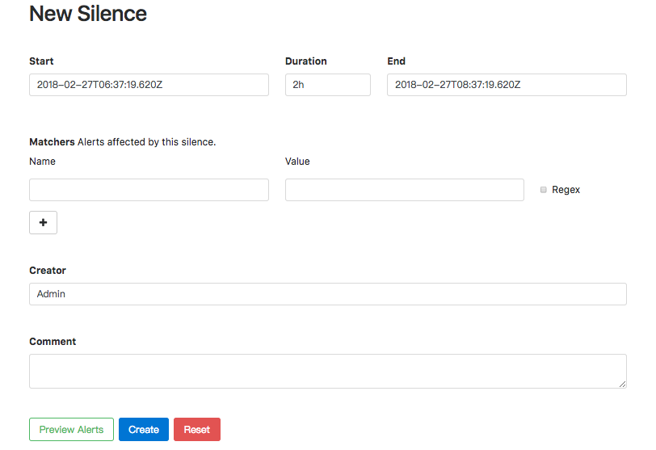
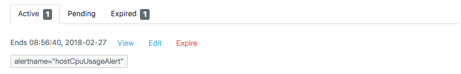

# 屏蔽告警通知

Alertmanager提供了方式可以帮助用户控制告警通知的行为，包括预先定义的抑制机制和临时定义的静默规则。

## 抑制机制

Alertmanager的抑制机制可以避免当某种问题告警产生之后用户接收到大量由此问题导致的一系列的其它告警通知。例如当集群不可用时，用户可能只希望接收到一条告警，告诉他这时候集群出现了问题，而不是大量的如集群中的应用异常、中间件服务异常的告警通知。

在Alertmanager配置文件中，使用inhibit_rules定义一组告警的抑制规则：

```
inhibit_rules:
  [ - <inhibit_rule> ... ]
```

每一条抑制规则的具体配置如下：

```
target_match:
  [ <labelname>: <labelvalue>, ... ]
target_match_re:
  [ <labelname>: <regex>, ... ]

source_match:
  [ <labelname>: <labelvalue>, ... ]
source_match_re:
  [ <labelname>: <regex>, ... ]

[ equal: '[' <labelname>, ... ']' ]
```

当已经发送的告警通知匹配到target_match和target_match_re规则，当有新的告警规则如果满足source_match或者定义的匹配规则，并且以发送的告警与新产生的告警中equal定义的标签完全相同，则启动抑制机制，新的告警不会发送。

例如，定义如下抑制规则：

```
- source_match:
    alertname: NodeDown
    severity: critical
  target_match:
    severity: critical
  equal:
    - node
```

例如当集群中的某一个主机节点异常宕机导致告警NodeDown被触发，同时在告警规则中定义了告警级别severity=critical。由于主机异常宕机，该主机上部署的所有服务，中间件会不可用并触发报警。根据抑制规则的定义，如果有新的告警级别为severity=critical，并且告警中标签node的值与NodeDown告警的相同，则说明新的告警是由NodeDown导致的，则启动抑制机制停止向接收器发送通知。

## 临时静默

除了基于抑制机制可以控制告警通知的行为以外，用户或者管理员还可以直接通过Alertmanager的UI临时屏蔽特定的告警通知。通过定义标签的匹配规则(字符串或者正则表达式)，如果新的告警通知满足静默规则的设置，则不停止向receiver发送通知。

进入Alertmanager UI，点击"New Silence"显示如下内容：



用户可以通过该UI定义新的静默规则的开始时间以及持续时间，通过Matchers部分可以设置多条匹配规则(字符串匹配或者正则匹配)。填写当前静默规则的创建者以及创建原因后，点击"Create"按钮即可。

通过"Preview Alerts"可以查看预览当前匹配规则匹配到的告警信息。静默规则创建成功后，Alertmanager会开始加载该规则并且设置状态为Pending,当规则生效后则进行到Active状态。



当静默规则生效以后，从Alertmanager的Alerts页面下用户将不会看到该规则匹配到的告警信息。


对于已经生效的规则，用户可以通过手动点击”Expire“按钮使当前规则过期。