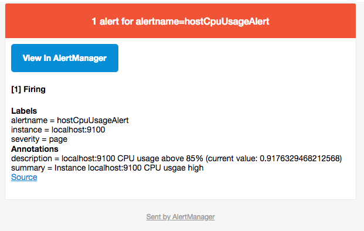

# 与SMTP邮件集成

每一个receiver可以对应一组邮件通知配置email_configs，如下所示：

```
name: <string>
email_configs:
  [ - <email_config>, ... ]
```

email_config配置

```
# Whether or not to notify about resolved alerts.
[ send_resolved: <boolean> | default = false ]

# The email address to send notifications to.
to: <tmpl_string>

# The sender address.
[ from: <tmpl_string> | default = global.smtp_from ]

# The SMTP host through which emails are sent.
[ smarthost: <string> | default = global.smtp_smarthost ]

# SMTP authentication information.
[ auth_username: <string> | default = global.smtp_auth_username ]
[ auth_password: <secret> | default = global.smtp_auth_password ]
[ auth_secret: <secret> | default = global.smtp_auth_secret ]
[ auth_identity: <string> | default = global.smtp_auth_identity ]

# The SMTP TLS requirement.
[ require_tls: <bool> | default = global.smtp_require_tls ]

# The HTML body of the email notification.
[ html: <tmpl_string> | default = '{{ template "email.default.html" . }}' ]

# Further headers email header key/value pairs. Overrides any headers
# previously set by the notification implementation.
[ headers: { <string>: <tmpl_string>, ... } ]
```

如果所有的邮件配置使用了相同的SMTP配置，则可以直接定义全局的SMTP配置。

```
global:
  [ smtp_from: <tmpl_string> ]
  [ smtp_smarthost: <string> ]
  [ smtp_auth_username: <string> ]
  [ smtp_auth_password: <secret> ]
  [ smtp_auth_secret: <secret> ]
  [ smtp_auth_identity: <string> ]
  [ smtp_require_tls: <bool> | default = true ]
```

以Gmail邮箱为例:

```
global:
  smtp_smarthost: smtp.gmail.com:587
  smtp_from: <smtp mail from>
  smtp_auth_username: <usernae>
  smtp_auth_identity: <username>
  smtp_auth_password: <password>

receivers:
  - name: default-receiver
    email_configs:
      - to: <mail to address>
```

> 需要注意的是新的Google账号安全规则需要使用”应用专有密码“作为邮箱登录密码

这时如果手动拉高主机CPU使用率，使得监控样本数据满足告警触发条件。在SMTP配置正确的情况下，可以接收到如下的告警内容：

