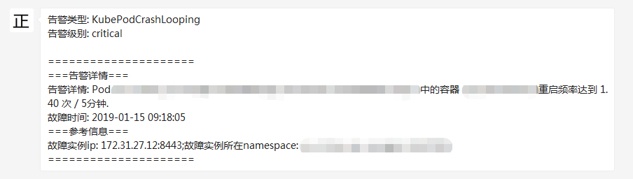

# 与企业微信集成

Alertmanager已经内置了对企业微信的支持，我们可以通过企业微信来管理报警，更进一步可以通过企业微信和微信的互通来直接将告警消息转发到个人微信上。

[prometheus官网](https://prometheus.io/docs/alerting/configuration/#wechat_config)中给出了企业微信的相关配置说明

```
# Whether or not to notify about resolved alerts.
[ send_resolved: <boolean> | default = false ]

# The API key to use when talking to the WeChat API.
[ api_secret: <secret> | default = global.wechat_api_secret ]

# The WeChat API URL.
[ api_url: <string> | default = global.wechat_api_url ]

# The corp id for authentication.
[ corp_id: <string> | default = global.wechat_api_corp_id ]

# API request data as defined by the WeChat API.
[ message: <tmpl_string> | default = '{{ template "wechat.default.message" . }}' ]
[ agent_id: <string> | default = '{{ template "wechat.default.agent_id" . }}' ]
[ to_user: <string> | default = '{{ template "wechat.default.to_user" . }}' ]
[ to_party: <string> | default = '{{ template "wechat.default.to_party" . }}' ]
[ to_tag: <string> | default = '{{ template "wechat.default.to_tag" . }}' ]
```

企业微信相关概念说明请参考[企业微信API说明](https://work.weixin.qq.com/api/doc#90000/90135/90665)，可以在企业微信的后台中建立多个应用，每个应用对应不同的报警分组，由企业微信来做接收成员的划分。具体配置参考如下：
```
global:
  resolve_timeout: 10m
  wechat_api_url: 'https://qyapi.weixin.qq.com/cgi-bin/'
  wechat_api_secret: '应用的secret，在应用的配置页面可以看到'
  wechat_api_corp_id: '企业id，在企业的配置页面可以看到'
templates:
- '/etc/alertmanager/config/*.tmpl'
route:
  group_by: ['alertname']
  group_wait: 30s
  group_interval: 5m
  repeat_interval: 12h
  routes:
  - receiver: 'wechat'
    continue: true
inhibit_rules:
- source_match:
receivers:
- name: 'wechat'
  wechat_configs:
  - send_resolved: false
    corp_id: '企业id，在企业的配置页面可以看到'
    to_user: '@all'
    to_party: ' PartyID1 | PartyID2 '
    message: '{{ template "wechat.default.message" . }}'
    agent_id: '应用的AgentId，在应用的配置页面可以看到'
    api_secret: '应用的secret，在应用的配置页面可以看到'
```
配置模板示例如下：
```
{{ define "wechat.default.message" }}
{{- if gt (len .Alerts.Firing) 0 -}}
{{- range $index, $alert := .Alerts -}}
{{- if eq $index 0 -}}
告警类型: {{ $alert.Labels.alertname }}
告警级别: {{ $alert.Labels.severity }}

=====================
{{- end }}
===告警详情===
告警详情: {{ $alert.Annotations.message }}
故障时间: {{ $alert.StartsAt.Format "2006-01-02 15:04:05" }}
===参考信息===
{{ if gt (len $alert.Labels.instance) 0 -}}故障实例ip: {{ $alert.Labels.instance }};{{- end -}}
{{- if gt (len $alert.Labels.namespace) 0 -}}故障实例所在namespace: {{ $alert.Labels.namespace }};{{- end -}}
{{- if gt (len $alert.Labels.node) 0 -}}故障物理机ip: {{ $alert.Labels.node }};{{- end -}}
{{- if gt (len $alert.Labels.pod_name) 0 -}}故障pod名称: {{ $alert.Labels.pod_name }}{{- end }}
=====================
{{- end }}
{{- end }}

{{- if gt (len .Alerts.Resolved) 0 -}}
{{- range $index, $alert := .Alerts -}}
{{- if eq $index 0 -}}
告警类型: {{ $alert.Labels.alertname }}
告警级别: {{ $alert.Labels.severity }}

=====================
{{- end }}
===告警详情===
告警详情: {{ $alert.Annotations.message }}
故障时间: {{ $alert.StartsAt.Format "2006-01-02 15:04:05" }}
恢复时间: {{ $alert.EndsAt.Format "2006-01-02 15:04:05" }}
===参考信息===
{{ if gt (len $alert.Labels.instance) 0 -}}故障实例ip: {{ $alert.Labels.instance }};{{- end -}}
{{- if gt (len $alert.Labels.namespace) 0 -}}故障实例所在namespace: {{ $alert.Labels.namespace }};{{- end -}}
{{- if gt (len $alert.Labels.node) 0 -}}故障物理机ip: {{ $alert.Labels.node }};{{- end -}}
{{- if gt (len $alert.Labels.pod_name) 0 -}}故障pod名称: {{ $alert.Labels.pod_name }};{{- end }}
=====================
{{- end }}
{{- end }}
{{- end }}
```

这时如果某一容器频繁重启，可以接收到如下的告警内容：


