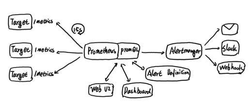
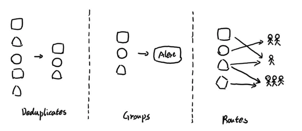

# Prometheus告警简介

告警在Prometheus的架构中被划分成两个独立的部分。如下所示，通过在Prometheus中定义告警触发条件规则，并向Alertmanager发送告警信息。

Alertmanager作为一个独立的组件，负责接收并处理来自Prometheus Server(也可以是其它的客户端程序)的告警信息。Alertmanager可以对这些告警信息进行进一步的处理，比如消除重复的告警信息，对告警信息进行分组并且路由到正确的接受方，Prometheus内置了对邮件，Slack等通知方式的支持，同时还支持与Webhook的通知集成，以支持更多的可能性，例如可以通过Webhook与钉钉或者企业微信进行集成。同时AlertManager还提供了静默和告警抑制机制来对告警通知行为进行优化。

## Alertmanager特性

#### 分组

分组机制可以将详细的告警信息合并成一个通知。在某些情况下，比如由于系统宕机导致大量的告警被同时触发，在这种情况下分组机制可以将这些被触发的告警合并为一个告警通知，避免一次性接受大量的告警通知，而无法对问题进行快速定位。

例如，当集群中有数百个正在运行的服务实例，并且为每一个实例设置了告警规则。假如此时发生了网络故障，可能导致大量的服务实例无法连接到数据库，结果就会有数百个告警被发送到Alertmanager。

而作为用户，可能只希望能够在一个通知中中就能查看哪些服务实例收到影响。这时可以按照服务所在集群或者告警名称对告警进行分组，而将这些告警内聚在一起成为一个通知。

告警分组，告警时间，以及告警的接受方式可以通过Alertmanager的配置文件进行配置。

#### 抑制

抑制是指当某一告警发出后，可以停止重复发送由此告警引发的其它告警的机制。

例如，当集群不可访问时触发了一次告警，通过配置Alertmanager可以忽略与该集群有关的其它所有告警。这样可以避免接收到大量与实际问题无关的告警通知。

抑制机制同样通过Alertmanager的配置文件进行设置。

#### 静默

静默提供了一个简单的机制可以快速根据标签对告警进行静默处理。如果接收到的告警符合静默的配置，Alertmanager则不会发送告警通知。

静默设置需要在Alertmanager的Werb页面上进行设置。

