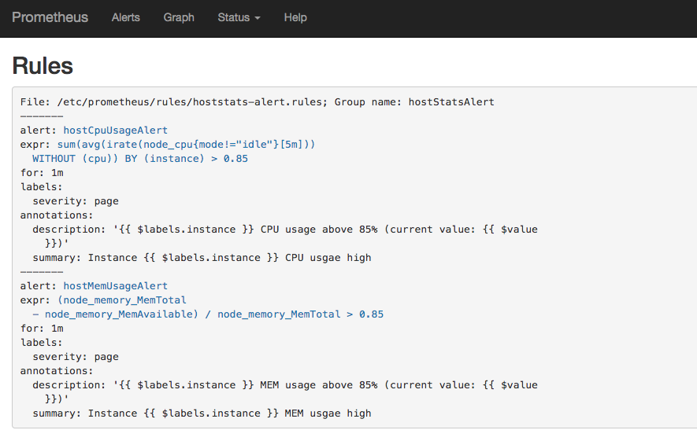
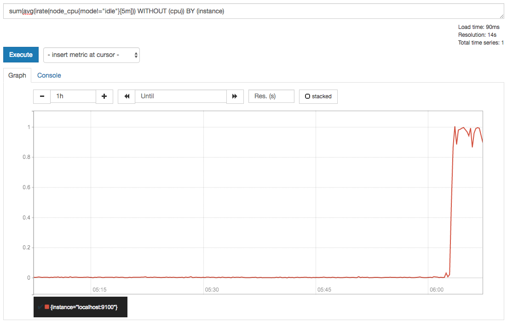
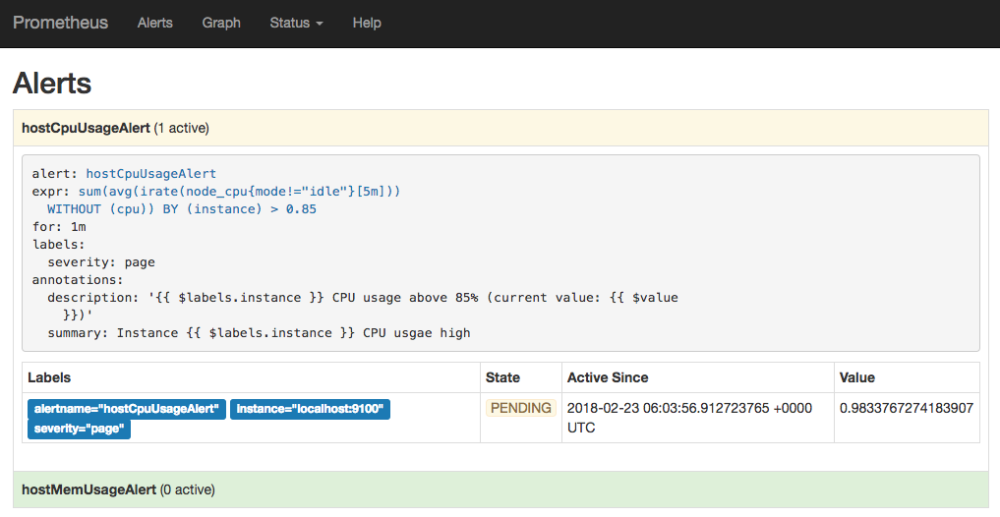
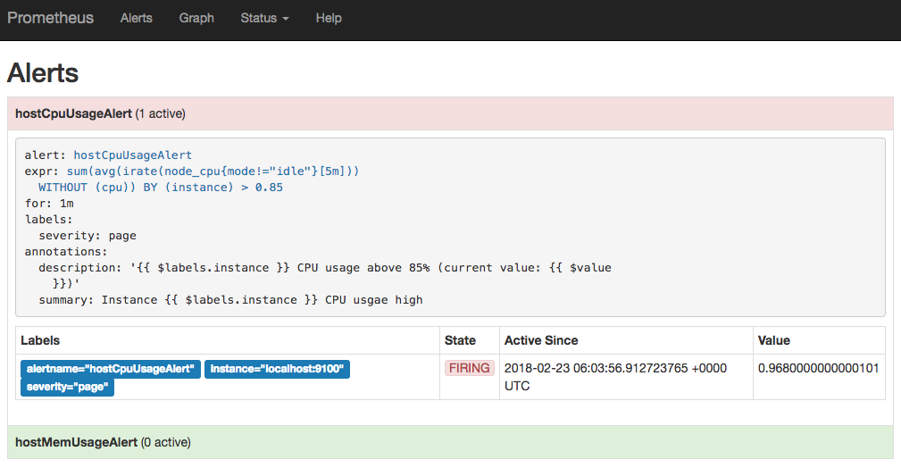

# 自定义Prometheus告警规则

Prometheus中的告警规则允许你基于PromQL表达式定义告警触发条件，Prometheus后端对这些触发规则进行周期性计算，当满足触发条件后则会触发告警通知。默认情况下，用户可以通过Prometheus的Web界面查看这些告警规则以及告警的触发状态。当Promthues与Alertmanager关联之后，可以将告警发送到外部服务如Alertmanager中并通过Alertmanager可以对这些告警进行进一步的处理。

## 定义告警规则

一条典型的告警规则如下所示：

```
groups:
- name: example
  rules:
  - alert: HighErrorRate
    expr: job:request_latency_seconds:mean5m{job="myjob"} > 0.5
    for: 10m
    labels:
      severity: page
    annotations:
      summary: High request latency
      description: description info
```

在告警规则文件中，我们可以将一组相关的规则设置定义在一个group下。在每一个group中我们可以定义多个告警规则(rule)。一条告警规则主要由以下几部分组成：

* alert：告警规则的名称。
* expr：基于PromQL表达式告警触发条件，用于计算是否有时间序列满足该条件。
* for：评估等待时间，可选参数。用于表示只有当触发条件持续一段时间后才发送告警。在等待期间新产生告警的状态为pending。
* labels：自定义标签，允许用户指定要附加到告警上的一组附加标签。
* annotations：用于指定一组附加信息，比如用于描述告警详细信息的文字等，annotations的内容在告警产生时会一同作为参数发送到Alertmanager。

为了能够让Prometheus能够启用定义的告警规则，我们需要在Prometheus全局配置文件中通过__rule_files__指定一组告警规则文件的访问路径，Prometheus启动后会自动扫描这些路径下规则文件中定义的内容，并且根据这些规则计算是否向外部发送通知：

```
rule_files:
  [ - <filepath_glob> ... ]
```

默认情况下Prometheus会每分钟对这些告警规则进行计算，如果用户想定义自己的告警计算周期，则可以通过`evaluation_interval`来覆盖默认的计算周期：

```
global:
  [ evaluation_interval: <duration> | default = 1m ]
```

## 模板化

一般来说，在告警规则文件的annotations中使用`summary`描述告警的概要信息，`description`用于描述告警的详细信息。同时Alertmanager的UI也会根据这两个标签值，显示告警信息。为了让告警信息具有更好的可读性，Prometheus支持模板化label和annotations的中标签的值。

通过`$labels.<labelname>`变量可以访问当前告警实例中指定标签的值。$value则可以获取当前PromQL表达式计算的样本值。

```
# To insert a firing element's label values:
{{ $labels.<labelname> }}
# To insert the numeric expression value of the firing element:
{{ $value }}
```

例如，可以通过模板化优化summary以及description的内容的可读性：

```
groups:
- name: example
  rules:

  # Alert for any instance that is unreachable for >5 minutes.
  - alert: InstanceDown
    expr: up == 0
    for: 5m
    labels:
      severity: page
    annotations:
      summary: "Instance {{ $labels.instance }} down"
      description: "{{ $labels.instance }} of job {{ $labels.job }} has been down for more than 5 minutes."

  # Alert for any instance that has a median request latency >1s.
  - alert: APIHighRequestLatency
    expr: api_http_request_latencies_second{quantile="0.5"} > 1
    for: 10m
    annotations:
      summary: "High request latency on {{ $labels.instance }}"
      description: "{{ $labels.instance }} has a median request latency above 1s (current value: {{ $value }}s)"
```

## 查看告警状态

如下所示，用户可以通过Prometheus WEB界面中的Alerts菜单查看当前Prometheus下的所有告警规则，以及其当前所处的活动状态。


同时对于已经pending或者firing的告警，Prometheus也会将它们存储到时间序列ALERTS{}中。

可以通过表达式，查询告警实例：

```
ALERTS{alertname="<alert name>", alertstate="pending|firing", <additional alert labels>}
```

样本值为1表示当前告警处于活动状态（pending或者firing），当告警从活动状态转换为非活动状态时，样本值则为0。

## 实例：定义主机监控告警

修改Prometheus配置文件prometheus.yml,添加以下配置：

```
rule_files:
  - /etc/prometheus/rules/*.rules
```


在目录/etc/prometheus/rules/下创建告警文件hoststats-alert.rules内容如下：

```
groups:
- name: hostStatsAlert
  rules:
  - alert: hostCpuUsageAlert
    expr: sum(avg without (cpu)(irate(node_cpu{mode!='idle'}[5m]))) by (instance) > 0.85
    for: 1m
    labels:
      severity: page
    annotations:
      summary: "Instance {{ $labels.instance }} CPU usgae high"
      description: "{{ $labels.instance }} CPU usage above 85% (current value: {{ $value }})"
  - alert: hostMemUsageAlert
    expr: (node_memory_MemTotal - node_memory_MemAvailable)/node_memory_MemTotal > 0.85
    for: 1m
    labels:
      severity: page
    annotations:
      summary: "Instance {{ $labels.instance }} MEM usgae high"
      description: "{{ $labels.instance }} MEM usage above 85% (current value: {{ $value }})"
```

重启Prometheus后访问Prometheus UI[http://127.0.0.1:9090/rules](http://127.0.0.1:9090/rules)可以查看当前以加载的规则文件。



切换到Alerts标签[http://127.0.0.1:9090/alerts](http://127.0.0.1:9090/alerts)可以查看当前告警的活动状态。


此时，我们可以手动拉高系统的CPU使用率，验证Prometheus的告警流程，在主机上运行以下命令：

```
cat /dev/zero>/dev/null
```

运行命令后查看CPU使用率情况，如下图所示：



Prometheus首次检测到满足触发条件后，hostCpuUsageAlert显示由一条告警处于活动状态。由于告警规则中设置了1m的等待时间，当前告警状态为PENDING，如下图所示：



如果1分钟后告警条件持续满足，则会实际触发告警并且告警状态为FIRING，如下图所示：



## 接下来

在这一小节中介绍了如何配置和使用Prometheus提供的告警能力，并且尝试实现了对主机CPU以及内存的告警规则设置。目前为止，我们只能通过Prometheus UI查看当前告警的活动状态。接下来，接下来我们将尝试利用Prometheus体系中的另一个组件Alertmanager对这些触发的告警进行处理，实现告警通知。