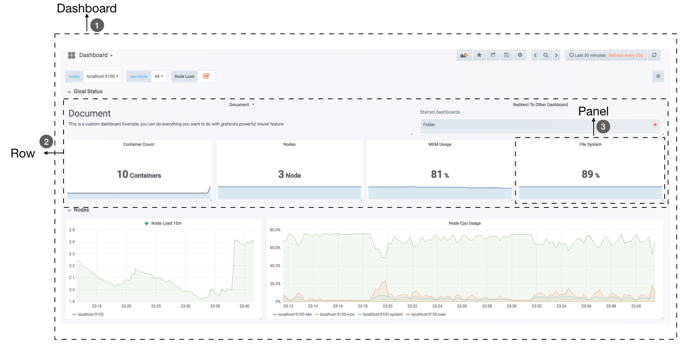

# Grafana简介

Console Template虽然能满足一定的可视化需求，但是也仅仅是对Prometheus的基本能力的补充。同时使用也会有许多问题，首先用户需要学习和了解Go Template模板语言，其它其支持的可视化图表类型也非常有限，最后其管理也有一定的成本。在第1章的“初识Prometheus”中我们已经尝试通过Grafana快速搭建过一个主机监控的Dashboard，在本章中将会带来读者学习如何使用Grafana创建更加精美的可视化报表。

## Grafana基本概念

首先Grafana是一个通用的可视化工具。‘通用’意味着Grafana不仅仅适用于展示Prometheus下的监控数据，也同样适用于一些其他的数据可视化需求。在开始使用Grafana之前，我们首先需要明确一些Grafana下的基本概念，以帮助用户能够快速理解Grafana。

### 数据源（Data Source）

对于Grafana而言，Prometheus这类为其提供数据的对象均称为数据源（Data Source）。目前，Grafana官方提供了对：Graphite, InfluxDB, OpenTSDB, Prometheus, Elasticsearch, CloudWatch的支持。对于Grafana管理员而言，只需要将这些对象以数据源的形式添加到Grafana中，Grafana便可以轻松的实现对这些数据的可视化工作。

### 仪表盘（Dashboard）

通过数据源定义好可视化的数据来源之后，对于用户而言最重要的事情就是实现数据的可视化。在Grafana中，我们通过Dashboard来组织和管理我们的数据可视化图表：

如上所示，在一个Dashboard中一个最基本的可视化单元为一个**Panel（面板）**，Panel通过如趋势图，热力图的形式展示可视化数据。 并且在Dashboard中每一个Panel是一个完全独立的部分，通过Panel的**Query Editor（查询编辑器）**我们可以为每一个Panel自己查询的数据源以及数据查询方式，例如，如果以Prometheus作为数据源，那在Query Editor中，我们实际上使用的是PromQL，而Panel则会负责从特定的Prometheus中查询出相应的数据，并且将其可视化。由于每个Panel是完全独立的，因此在一个Dashboard中，往往可能会包含来自多个Data Source的数据。

Grafana通过插件的形式提供了多种Panel的实现，常用的如：Graph Panel，Heatmap Panel，SingleStat Panel以及Table Panel等。用户还可通过插件安装更多类型的Panel面板。

除了Panel以外，在Dashboard页面中，我们还可以定义一个**Row（行）**，来组织和管理一组相关的Panel。

除了Panel, Row这些对象以外，Grafana还允许用户为Dashboard定义**Templating variables（模板参数）**，从而实现可以与用户动态交互的Dashboard页面。同时Grafana通过JSON数据结构管理了整个Dasboard的定义，因此这些Dashboard也是非常方便进行共享的。Grafana还专门为Dashboard提供了一个共享服务：[https://grafana.com/dashboards](https://grafana.com/dashboards)，通过该服务用户可以轻松实现Dashboard的共享，同时我们也能快速的从中找到我们希望的Dashboard实现，并导入到自己的Grafana中。

### 组织和用户

作为一个通用可视化工具，Grafana除了提供灵活的可视化定制能力以外，还提供了面向企业的组织级管理能力。在Grafana中Dashboard是属于一个**Organization（组织）**，通过Organization，可以在更大规模上使用Grafana，例如对于一个企业而言，我们可以创建多个Organization，其中**User（用户）**可以属于一个或多个不同的Organization。 并且在不同的Organization下，可以为User赋予不同的权限。 从而可以有效的根据企业的组织架构定义整个管理模型。