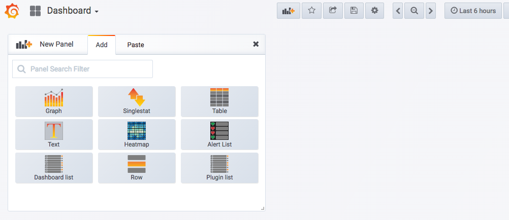
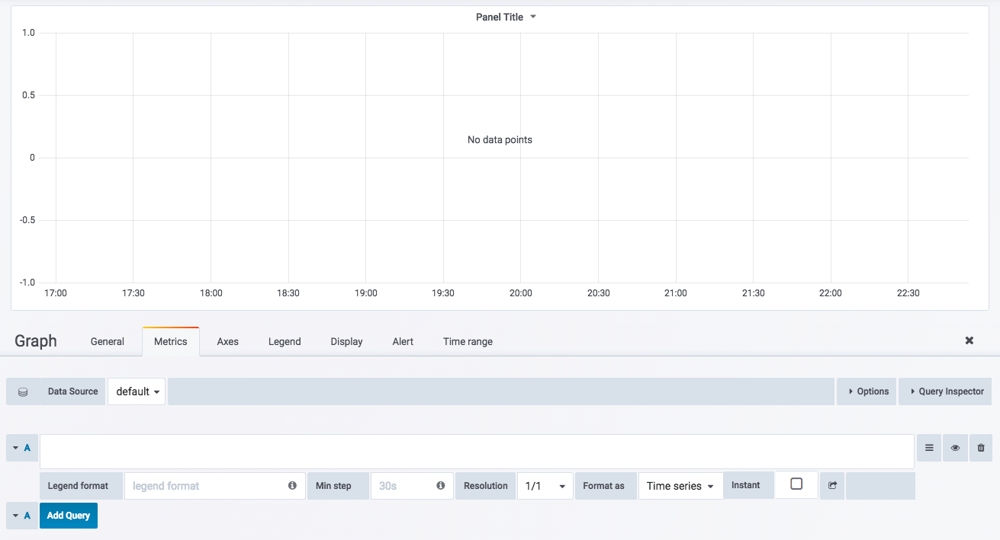
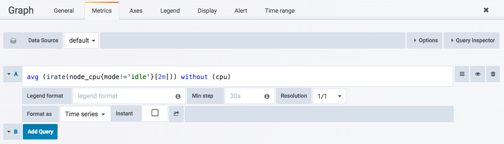
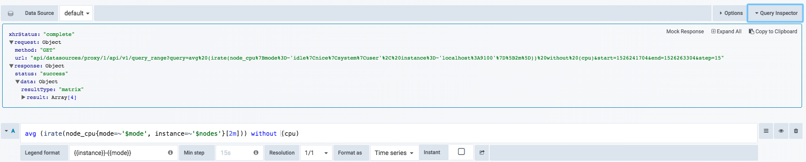

# Panel与数据可视化

在第1章的“初始Prometheus”部分，我们已经带领读者大致了解了Grafana的基本使用方式。对于Grafana而言，Prometheus就是一个用于存储监控样本数据的数据源（Data Source）通过使用PromQL查询特定Prometheus实例中的数据并且在Panel中实现可视化。

接下来，我们将带领读者了解如何通过Panel创建精美的可视化图表。

## 认识Panel

Panel是Grafana中最基本的可视化单元。每一种类型的面板都提供了相应的查询编辑器(Query Editor)，让用户可以从不同的数据源（如Prometheus）中查询出相应的监控数据，并且以可视化的方式展现。

Grafana中所有的面板均以插件的形式进行使用，当前内置了5种类型的面板，分别是：Graph，Singlestat，Heatmap, Dashlist，Table以及Text。

其中像Graph这样的面板允许用户可视化任意多个监控指标以及多条时间序列。而Siglestat则必须要求查询结果为单个样本。Dashlist和Text相对比较特殊，它们与特定的数据源无关。

通过Grafana UI用户可以在一个Dashboard下添加Panel，点击Dashboard右上角的“Add Panel”按钮，如下所示，将会显示当前系统中所有可使用的Panel类型：



选择想要创建的面板类型即可。这里以Graph面板为例，创建Panel之后，并切换到编辑模式，就可以看到类似于如下的面板编辑界面了：



对于一个Panel而言，一般来说会包含2个主要的配置选项：General（通用设置）、Metrics（度量指标）。其余的配置则根据Panel类型的不同而不同。

在通用设置中，除了一些Panel的基本信息以外，最主要的能力就是定义动态Panel的能力，这部分内容会在本章的“模板化Dashboard”小结中详细介绍。

对于使用Prometheus作为数据源的用户，最主要的需要了解的就是Metrics设置的使用。在Metric选项中可以定义了Grafana从哪些数据源中查询样本数据。**Data Source**中指定当前查询的数据源，Grafana会加载当前组织中添加的所有数据源。其中还会包含两个特殊的数据源：**Mixed**和**Grafana**。 Mixed用于需要从多个数据源中查询和渲染数据的场景，Grafana则用于需要查询Grafana自身状态时使用。

当选中数据源时，Panel会根据当前数据源类型加载不同的Query Editor界面。这里我们主要介绍Prometheus Query Editor，如下所示，当选中的数据源类型为Prometheus时，会显示如下界面：



Grafana提供了对PromQL的完整支持，在Query Editor中，可以添加任意个Query，并且使用PromQL表达式从Prometheus中查询相应的样本数据。

```
avg (irate(node_cpu{mode!='idle'}[2m])) without (cpu)
```

每个PromQL表达式都可能范围多条时间序列。**Legend format**用于控制如何格式化每条时间序列的图例信息。Grafana支持通过模板的方式，根据时间序列的标签动态生成图例名称，例如：使用{{instance}}表示使用当前事件序列instance标签的值作为图例名称：

```
{{instance}}-{{mode}}
```

当查询到的样本数据量非常大时可以导致Grafana渲染图标时出现一些性能问题，通过**Min Step**可以控制Prometheus查询数据时的最小步长（Step），从而减少从Prometheus返回的数据量。

**Resolution**选项，则可以控制Grafana自身渲染的数据量。例如，如果**Resolution**的值为**1/10**，Grafana会将Prometeus返回的10个样本数据合并成一个点。因此**Resolution**越小可视化的精确性越高，反之，可视化的精度越低。

**Format as**选项定义如何格式化Prometheus返回的样本数据。这里提供了3个选项：Table,Time Series和Heatmap，分别用于Tabel面板，Graph面板和Heatmap面板的数据可视化。

除此以外，Query Editor还提供了调试相关的功能，点击**Query Inspector**可以展开相关的调试面板：



在面板中，可以查看当前Prometheus返回的样本数据，用户也可以提供Mock数据渲染图像。