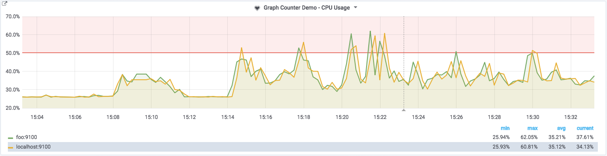
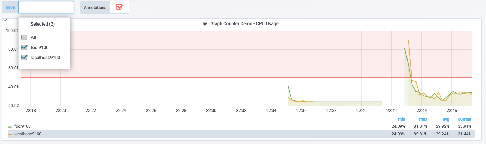
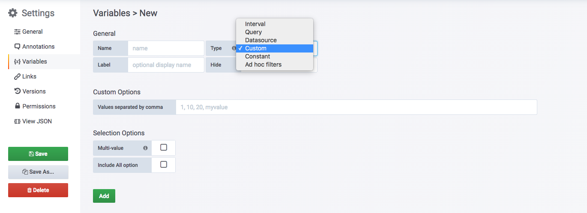
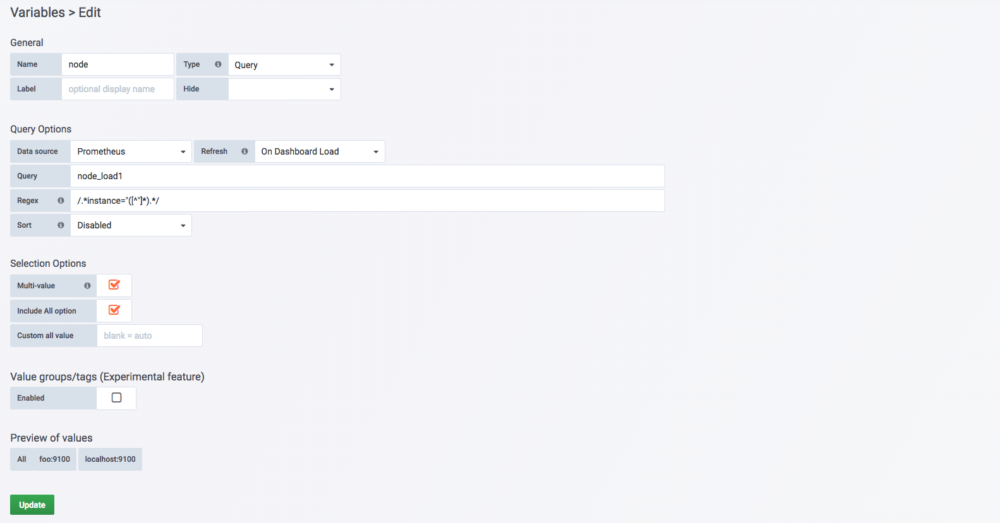
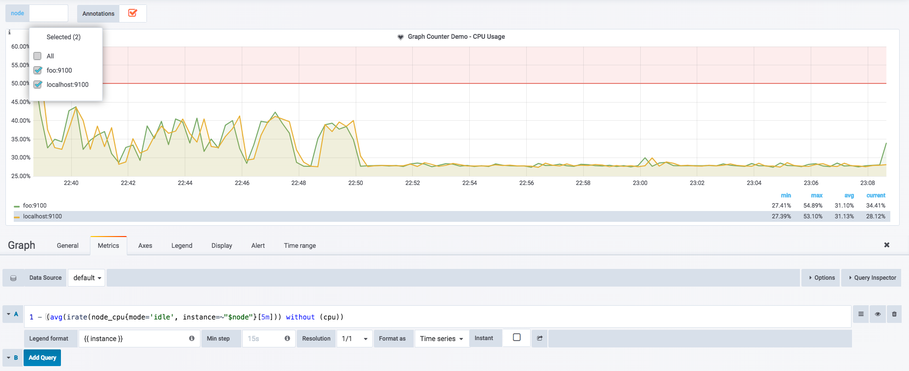
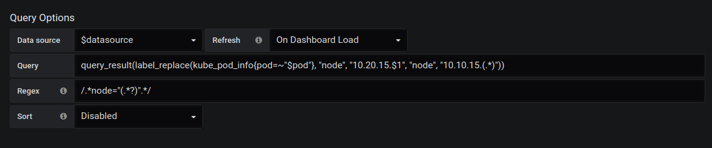
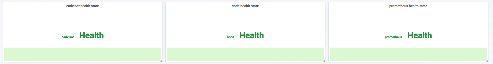
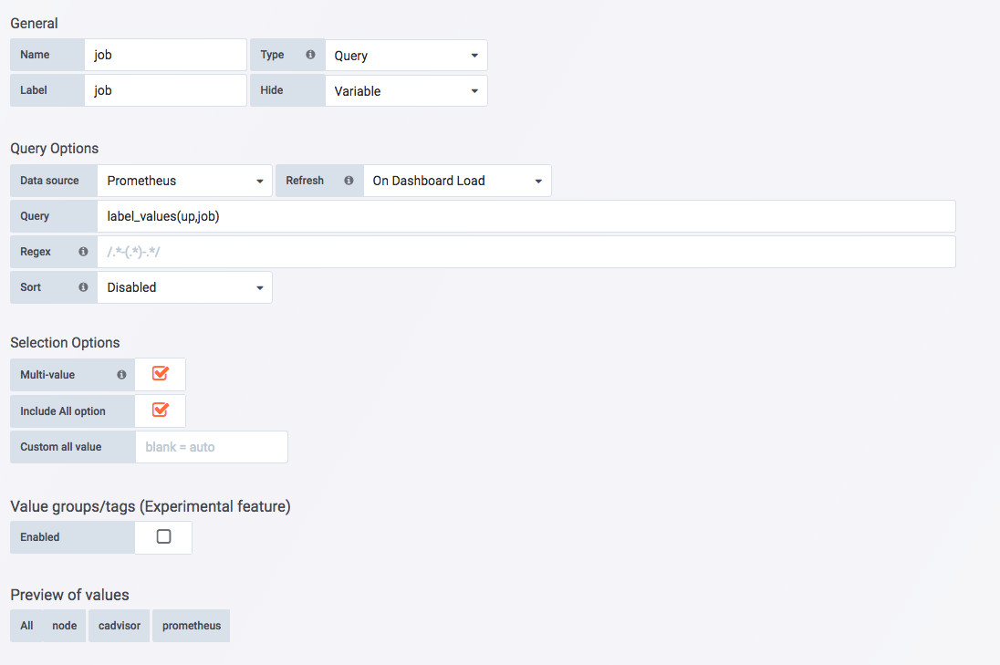
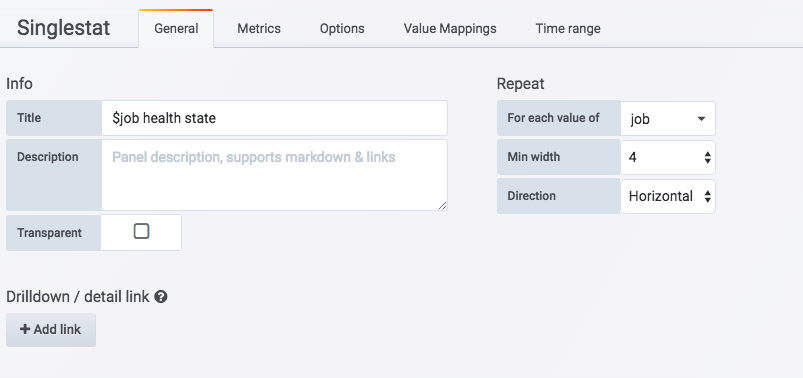
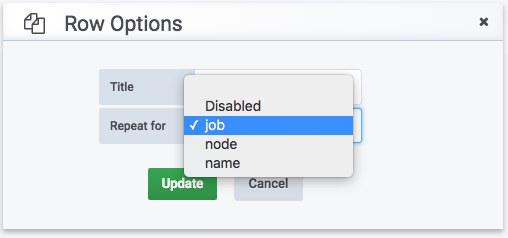

# 模板化Dashboard

在前面的小节中介绍了Grafana中4中常用的可视化面板的使用，通过在面板中使用PromQL表达式，Grafana能够方便的将Prometheus返回的数据进行可视化展示。例如，在展示主机CPU使用率时，我们使用了如下表达式：

```
1 - (avg(irate(node_cpu{mode='idle'}[5m])) without (cpu))
```

该表达式会返回当前Prometheus中存储的所有时间序列，每一台主机都会有一条单独的曲线用于体现其CPU使用率的变化情况：



而当用户只想关注其中某些主机时，基于当前我们已经学习到的知识只有两种方式，要么每次手动修改Panel中的PromQL表达式，要么直接为这些主机创建单独的Panel。但是无论如何，这些硬编码方式都会直接导致Dashboard配置的频繁修改。在这一小节中我们将学习使用Dashboard变量的方式解决以上问题。

## 变量

在Grafana中用户可以为Dashboard定义一组变量（Variables），变量一般包含一个到多个可选值。如下所示，Grafana通过将变量渲染为一个下拉框选项，从而使用户可以动态的改变变量的值：



例如，这里定义了一个名为node的变量，用户可以通过在PromQL表达式或者Panel的标题中通过以下形式使用该变量：

```
1 - (avg(irate(node_cpu{mode='idle', instance=~"$node"}[5m])) without (cpu))
```

变量的值可以支持单选或者多选，当对接Prometheus时，Grafana会自动将$node的值格式化为如“**host1|host2|host3**”的形式。配合使用PromQL的标签正则匹配“**=~**”，通过动态改变PromQL从而实现基于标签快速对时间序列进行过滤。

## 变量定义

通过Dashboard页面的Settings选项，可以进入Dashboard的配置页面并且选择Variables子菜单:



用户需要指定变量的名称，后续用户就可以通过$variable_name的形式引用该变量。Grafana目前支持6种不同的变量类型，而能和Prometheus一起工作的主要包含以下5种类型：

|类型|工作方式|
|-|--|
|Query|允许用户通过Datasource查询表达式的返回值动态生成变量的可选值|
|Interval|该变量代表时间跨度，通过Interval类型的变量，可以动态改变PromQL区间向量表达式中的时间范围。如rate(node_cpu[2m])|
|Datasource|允许用户动态切换当前Dashboard的数据源，特别适用于同一个Dashboard展示多个数据源数据的情况|
|Custom|用户直接通过手动的方式，定义变量的可选值|
|Constant|常量，在导入Dashboard时，会要求用户设置该常量的值|

Label属性用于指定界面中变量的显示名称，Hide属性则用于指定在渲染界面时是否隐藏该变量的下拉框。

## 使用变量过滤时间序列

当Prometheus同时采集了多个主机节点的监控样本数据时，用户希望能够手动选择并查看其中特定主机的监控数据。这时我们需要使用Query类型的变量。



如上所示，这里我们为Dashboard创建了一个名为node的变量，并且指定其类型为Query。Query类型的变量，允许用户指定数据源以及查询表达式，并通过正则匹配（Regex）的方式对查询结果进行处理，从而动态生成变量的可选值。在这里指定了数据源为Prometheus，通过使用node_load1我们得到了两条时间序列：

```
node_load1{instance="foo:9100",job="node"}
node_load1{instance="localhost:9100",job="node"}
```

通过指定正则匹配表达式为```/.*instance="([^"]*).*/```从而匹配出标签instance的值作为node变量的所有可选项，即：

```
foo:9100
localhost:9100
```

**Selection Options**选项中可以指定该变量的下拉框是否支持多选，以及是否包含全选（All）选项。

保存变量后，用户可以在Panel的General或者Metrics中通过$node的方式使用该变量，如下所示：



这里需要注意的是，如果允许用户多选在PromQL表达式中应该使用标签的正则匹配模式，因为Grafana会自动将多个选项格式化为如“foo:9100|localhost:9100”的形式。

使用Query类型的变量能够根据允许用户能够根据时间序列的特征维度对数据进行过滤。在定义Query类型变量时，除了使用PromQL查询时间序列以过滤标签的方式以外，Grafana还提供了几个有用的函数：

|函数|作用|
|--|---|
|label_values(label)|返回Prometheus所有监控指标中，标签名为label的所有可选值|
|label_values(metric, label)|返回Prometheus所有监控指标metric中，标签名为label的所有可选值|
|metrics(metric)|返回所有指标名称满足metric定义正则表达式的指标名称|
|query_result(query)|返回prometheus查询语句的查询结果|

例如，当需要监控Prometheus所有采集任务的状态时，可以使用如下方式，获取当前所有采集任务的名称：

```
label_values(up, job)
```

例如，有时候我们想要动态修改变量查询结果。比如某一个节点绑定了多个ip，一个用于内网访问，一个用于外网访问，此时prometheus采集到的指标是内网的ip，但我们需要的是外网ip。这里我们想要能在Grafana中动态改变标签值，进行ip段的替换，而避免从prometheus或exporter中修改采集指标。

这时需要使用grafana的query_result函数
```
# 将10.10.15.xxx段的ip地址替换为10.20.15.xxx段 注：替换端口同理
query_result(label_replace(kube_pod_info{pod=~"$pod"}, "node", "10.20.15.$1", "node", "10.10.15.(.*)"))
```
```
# 通过正则从返回结果中匹配出所需要的ip地址
regex：/.*node="(.*?)".*/
```
在grafana中配置如图：



## 使用变量动态创建Panel和Row

当在一个Panel中展示多条时间序列数据时，通过使用变量可以轻松实现对时间序列的过滤，提高用户交互性。除此以外，我们还可以使用变量自动生成Panel或者Row。 如下所示，当需要可视化当前系统中所有采集任务的监控任务运行状态时，由于Prometheus的采集任务配置可能随时发生变更，通过硬编码的形式实现，会导致Dashboard配置的频繁变更：



如下所示，这里为Dashboard定义了一遍名为job的变量：



通过使用label_values函数，获取到当前Prometheus监控指标up中所有可选的job标签的值：

```
label_values(up, job)
```

如果变量启用了Multi-value或者Include All Option选项的变量，那么在Panel的General选项的Repeat中可以选择自动迭代的变量，这里使用了Singlestat展示所有监控采集任务的状态：



Repeat选项设置完成后，Grafana会根据当前用户的选择，自动创建一个到多个Panel实例。 为了能够使Singlestat Panel能够展示正确的数据，如下所示，在Prometheus中，我们依然使用了$job变量，不过此时的$job反应的是当前迭代的值：


而如果还希望能够自动生成Row，只需要在Row的设置中，选择需要Repeat的变量即可：


