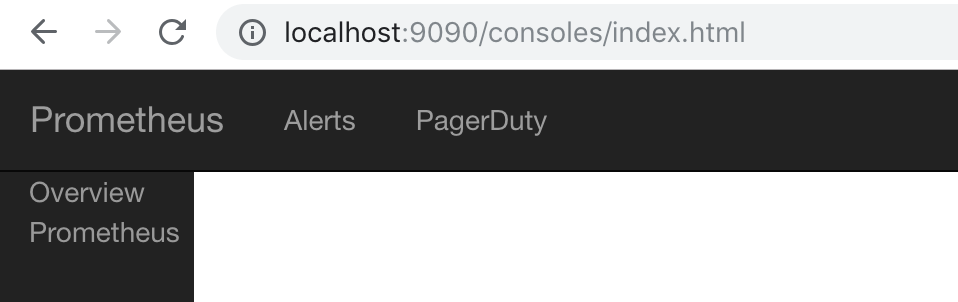
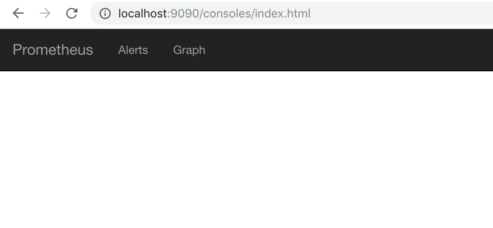
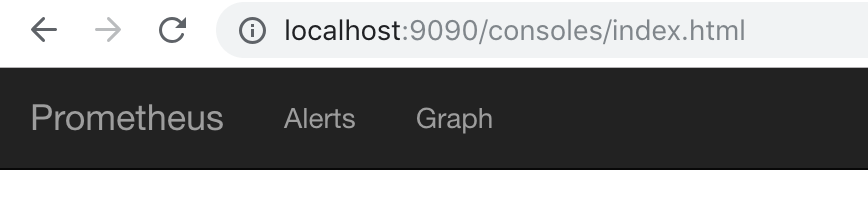
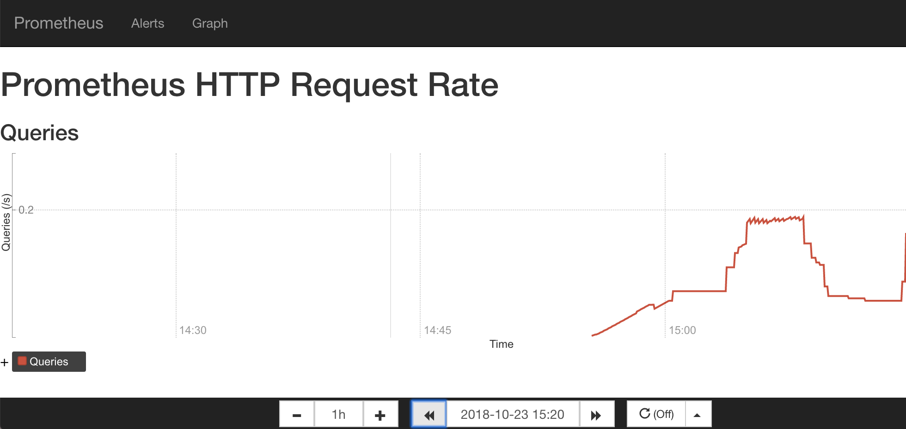

# 使用Console Template

在第1章以及第2章的内容中，读者已经对Prometheus已经有了一个相对完成的认识，并且我们已经学习了如何通过PromQL对时间序列数据进行查询和分析，并且通过Prometheus中的Graph面板查询数据形成图表。但是确定也很明显，这些查询结果都是临时的，无法持久化的，更别说我们想实时关注某些特定监控指标的变化趋势。

为了简化这些问题Prometheus内置了一个简单的解决方案`Console Template`,它允许用户通过Go模板语言创建任意的控制台界面，并且通过Prometheus Server对外提供访问路径。

## 快速开始

首先我们先从一个小例子开始，创建我们的第一个Console Template页面。与Console Template有关的两个启动参数为`--web.console.libraries`和`--web.console.templates`,其分别指定页面组件以及页面的存储路径。默认情况下其分别指向Prometheus当前安装路径的`console_libraries`和`consoles`目录。

Prometheus在`console_libraries`目录中已经内置了一些基本的界面组件，用户可以直接使用。

在`consoles`目录下创建index.html文件后，刷新Prometheus界面可以看到在顶部菜单中多了一个Consoles菜单项，如下所示。该选项默认指向`consoles/index.html`文件：


当然，这个时候点击该菜单，我们会看到一个空白页。因为目前index.html文件中还未填充任何内容：

## 定义页面菜单

首先，我们先直接使用console_libraries中定义的`head`组件，并加入到index.html文件中：

```
{{template "head" .}}
```

此时，如果我们刷新浏览器可以看到以下内容：



`head`组件的定义，读者可以通过关键字`define "head"`在console_libraries目录中查找。默认其应该是定义在`prom.lib`文件中：

``` go
{{ define "head" }}
<html>
<head>
{{ template "prom_console_head" }}
</head>
<body>
{{ template "navbar" . }}
{{ end }}
```

如果需要定制化菜单的内容，那一样的读者只需要找到`navbar`组件的定义即可。当然用户也可以创建自己的组件。 例如，如果我们希望Console Template页面的菜单与Prometheus UI一致，只需要修改navbar组件的定义即可，找到`menu.lib`并修改navbar组件:

```
{{ define "navbar" }}
<nav class="navbar navbar-inverse navbar-static-top">
  <div class="container-fluid">
    <!-- Brand and toggle get grouped for better mobile display -->
    <div class="navbar-header">
      <button type="button" class="navbar-toggle collapsed" data-toggle="collapse" data-target="#bs-example-navbar-collapse-1">
        <span class="sr-only">Toggle navigation</span>
        <span class="icon-bar"></span>
        <span class="icon-bar"></span>
        <span class="icon-bar"></span>
      </button>
      <a class="navbar-brand" href="{{ pathPrefix }}/">Prometheus</a>
    </div>

    <div class="collapse navbar-collapse" id="bs-example-navbar-collapse-1">
      <ul class="nav navbar-nav">
        <li><a href="{{ pathPrefix }}/alerts">Alerts</a></li>
        <li><a href="{{ pathPrefix }}/graph">Graph</a></li>
      </div>
    </ul>
  </div>
</nav>
{{ end }}
```

如果不需要侧边菜单栏，直接在head组件中移除`{{ template "menu" . }}`部分即可，修改后刷新页面，如下所示：



无论是`.lib`文件还是`.html`文件均使用了Go Template的语言，感兴趣的读者可以自行在Go语言官网了解更多内容`https://golang.org/pkg/text/template/`

## 定义图表

添加图表

```
<h1>Prometheus HTTP Request Rate</h1>

<h3>Queries</h3>
<div id="queryGraph"></div>
<script>
new PromConsole.Graph({
  node: document.querySelector("#queryGraph"),
  expr: "sum(rate(prometheus_http_request_duration_seconds_count{job='prometheus'}[5m]))",
  name: "Queries",
  yAxisFormatter: PromConsole.NumberFormatter.humanizeNoSmallPrefix,
  yHoverFormatter: PromConsole.NumberFormatter.humanizeNoSmallPrefix,
  yUnits: "/s",
  yTitle: "Queries"
})
</script>
```



添加查询链接：

```
<h3>Links</h3>
{{ template "prom_query_drilldown" (args "prometheus_build_info") }}
```

## 时间轴控制区域

```
{{ template "prom_graph_timecontrol" . }}
```

