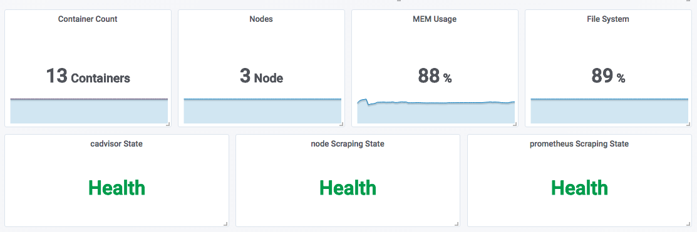
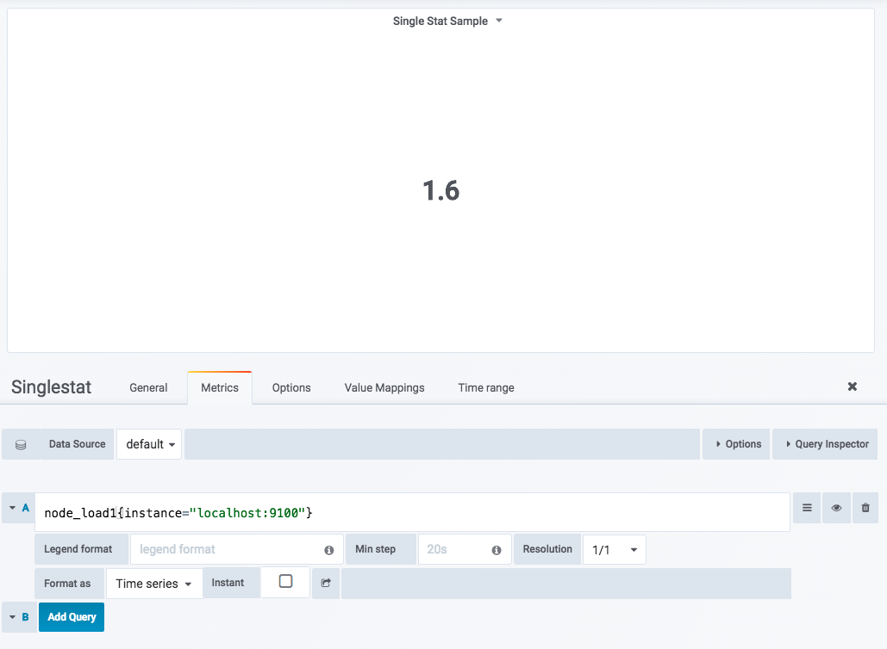
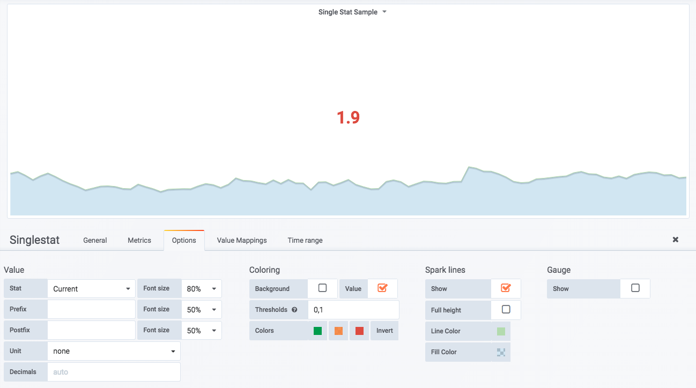
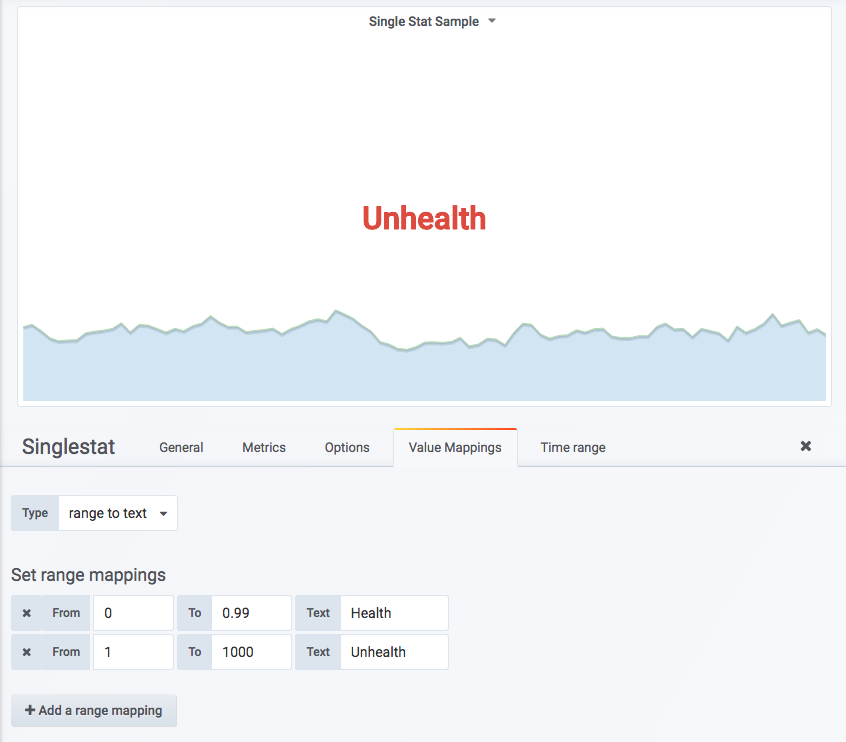
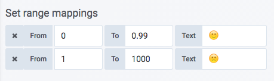

# 当前状态：SingleStat面板

SingleStat Panel侧重于展示系统的当前状态而非变化趋势。如下所示，在以下场景中特别适用于使用SingleStat：

* 当前系统中所有服务的运行状态；
* 当前基础设施资源的使用量；
* 当前系统中某些事件发生的次数或者资源数量等。

如下所示，是使用SingleStat进行数据可视化的显示效果：



## 使用SingleStat Panel

从Dashboardc创建Singlestat Panel，并进入编辑页面， 如下所示：



对于SingleStat Panel而言，其只能处理一条时间序列，否则页面中会提示“Multiple Series Error”错误信息。这里使用如下PromQL查询当前主机负载：

```
node_load1{instance="localhost:9100"}
```

默认情况下，当前面板中会显示当前时间序列中所有样本的平均值，而实际情况下，我们需要显示的是当前主机当前的负载情况，因此需要通过SingleStat Panel的**Options**选项控制当前面板的显示模式：



如上所示，通过Value配置项组可以控制当前面板中显示的值，以及字体大小等。对于主机负载而言，我们希望能够显示当前的最新值，因此修改Stat为**Current**即可。

如果希望面板能够根据不同的值显示不同的颜色的话，则可以定义**Thresholds**与**Colors**的映射关系，例如，定义Thresholds的分割区间值为“0,1”，则当Value的值落到不同的范围内时，将显示不同的颜色。

如果希望能够显示当前时间序列的样本值变化情况，则可以启用Spark lines配置。启用之后，Singlestat面板中除了会显示当前的最新样本值以外，也会同时将时间序列中的数据已趋势图的形式进行展示。

除了通过数字大小反应当前状态以外，在某些场景下我们可能更关心的是这些数字表示的意义。例如，在Prometheus监控服务的健康状态时，在样本数据中会通过0表示不健康，1表示健康。 但是如果直接将0或1显示在面板中，那么可视化效果将缺乏一定的可读性。

为了提升数字的可读性，可以在Singlestat Panel中可以通过**Value Mappings**定义值的映射关系。Siglesta支持值映射（value to text）和区间映射（range to text）两种方式。 如下所示：



当面板中Value的值在0~0.99范围内则显示为Health，否则显示为Unhealth。这种模式特别适合于展示服务的健康状态。 当然你也可以将Value映射为任意的字符，甚至是直接使用Emoji([http://www.iemoji.com/](http://www.iemoji.com/))表情：

