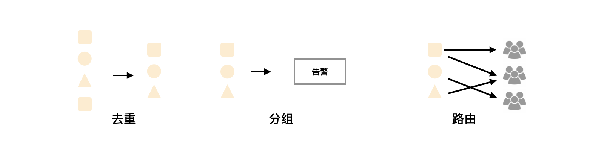
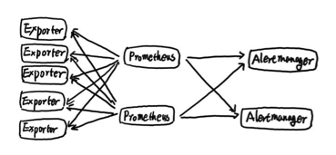
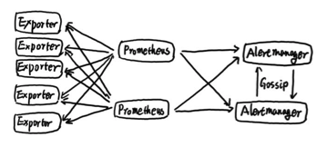
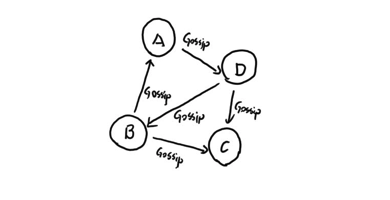
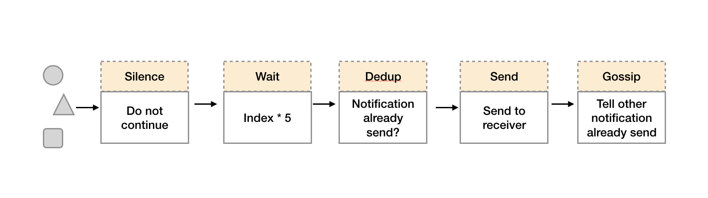
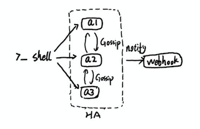
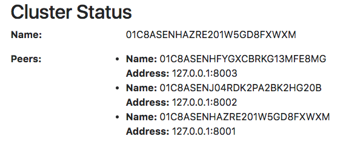

# Alertmanager高可用

在上一小节中我们主要讨论了Prometheus Server自身的高可用问题。而接下来，重点将放在告警处理也就是Alertmanager部分。如下所示。


为了提升Promthues的服务可用性，通常用户会部署两个或者两个以上的Promthus Server，它们具有完全相同的配置包括Job配置，以及告警配置等。当某一个Prometheus Server发生故障后可以确保Promthues持续可用。

同时基于Alertmanager的告警分组机制即使不同的Prometheus Sever分别发送相同的告警给Alertmanager，Alertmanager也可以自动将这些告警合并为一个通知向receiver发送。



但不幸的是，虽然Alertmanager能够同时处理多个相同的Prometheus Server所产生的告警。但是由于单个Alertmanager的存在，当前的部署结构存在明显的单点故障风险，当Alertmanager单点失效后，告警的后续所有业务全部失效。

如下所示，最直接的方式，就是尝试部署多套Alertmanager。但是由于Alertmanager之间不存在并不了解彼此的存在，因此则会出现告警通知被不同的Alertmanager重复发送多次的问题。



为了解决这一问题，如下所示。Alertmanager引入了Gossip机制。Gossip机制为多个Alertmanager之间提供了信息传递的机制。确保及时在多个Alertmanager分别接收到相同告警信息的情况下，也只有一个告警通知被发送给Receiver。



## Gossip协议

Gossip是分布式系统中被广泛使用的协议，用于实现分布式节点之间的信息交换和状态同步。Gossip协议同步状态类似于流言或者病毒的传播，如下所示：



一般来说Gossip有两种实现方式分别为Push-based和Push-based。在Push-based当集群中某一节点A完成一个工作后，随机的从其它节点B并向其发送相应的消息，节点B接收到消息后在重复完成相同的工作，直到传播到集群中的所有节点。而Pull-based的实现中节点A会随机的向节点B发起询问是否有新的状态需要同步，如果有则返回。

在简单了解了Gossip协议之后，我们来看Alertmanager是如何基于Gossip协议实现集群高可用的。如下所示，当Alertmanager接收到来自Prometheus的告警消息后，会按照以下流程对告警进行处理：



1. 在第一个阶段Silence中，Alertmanager会判断当前通知是否匹配到任何的静默规则，如果没有则进入下一个阶段，否则则中断流水线不发送通知。
2. 在第二个阶段Wait中，Alertmanager会根据当前Alertmanager在集群中所在的顺序(index)等待index * 5s的时间。
3. 当前Alertmanager等待阶段结束后，Dedup阶段则会判断当前Alertmanager数据库中该通知是否已经发送，如果已经发送则中断流水线，不发送告警，否则则进入下一阶段Send对外发送告警通知。
4. 告警发送完成后该Alertmanager进入最后一个阶段Gossip，Gossip会通知其他Alertmanager实例当前告警已经发送。其他实例接收到Gossip消息后，则会在自己的数据库中保存该通知已发送的记录。

因此如下所示，Gossip机制的关键在于两点：


* Silence设置同步：Alertmanager启动阶段基于Pull-based从集群其它节点同步Silence状态，当有新的Silence产生时使用Push-based方式在集群中传播Gossip信息。
* 通知发送状态同步：告警通知发送完成后，基于Push-based同步告警发送状态。Wait阶段可以确保集群状态一致。

Alertmanager基于Gossip实现的集群机制虽然不能保证所有实例上的数据时刻保持一致，但是实现了CAP理论中的AP系统，即可用性和分区容错性。同时对于Prometheus Server而言保持了配置了简单性，Promthues Server之间不需要任何的状态同步。

## 搭建本地集群环境

为了能够让Alertmanager节点之间进行通讯，需要在Alertmanager启动时设置相应的参数。其中主要的参数包括：

* --cluster.listen-address string: 当前实例集群服务监听地址
* --cluster.peer value: 初始化时关联的其它实例的集群服务地址

例如：

定义Alertmanager实例a1，其中Alertmanager的服务运行在9093端口，集群服务地址运行在8001端口。

```
alertmanager  --web.listen-address=":9093" --cluster.listen-address="127.0.0.1:8001" --config.file=/etc/prometheus/alertmanager.yml  --storage.path=/data/alertmanager/
```

定义Alertmanager实例a2，其中主服务运行在9094端口，集群服务运行在8002端口。为了将a1，a2组成集群。 a2启动时需要定义--cluster.peer参数并且指向a1实例的集群服务地址:8001。

```
alertmanager  --web.listen-address=":9094" --cluster.listen-address="127.0.0.1:8002" --cluster.peer=127.0.0.1:8001 --config.file=/etc/prometheus/alertmanager.yml  --storage.path=/data/alertmanager2/
```

为了能够在本地模拟集群环境，这里使用了一个轻量级的多线程管理工具goreman。使用以下命令可以在本地安装goreman命令行工具。

```
go get github.com/mattn/goreman
```

### 创建Alertmanager集群

创建Alertmanager配置文件/etc/prometheus/alertmanager-ha.yml, 为了验证Alertmanager的集群行为，这里在本地启动一个webhook服务用于打印Alertmanager发送的告警通知信息。

```
route:
  receiver: 'default-receiver'
receivers:
  - name: default-receiver
    webhook_configs:
    - url: 'http://127.0.0.1:5001/'
```

本地webhook服务可以直接从Github获取。

```
# 获取alertmanager提供的webhook示例，如果该目录下定义了main函数，go get会自动将其编译成可执行文件
go get github.com/prometheus/alertmanager/examples/webhook
# 设置环境变量指向GOPATH的bin目录
export PATH=$GOPATH/bin:$PATH
# 启动服务
webhook
```

示例结构如下所示：



创建alertmanager.procfile文件，并且定义了三个Alertmanager节点（a1，a2，a3）以及用于接收告警通知的webhook服务:

```
a1: alertmanager  --web.listen-address=":9093" --cluster.listen-address="127.0.0.1:8001" --config.file=/etc/prometheus/alertmanager-ha.yml  --storage.path=/data/alertmanager/ --log.level=debug
a2: alertmanager  --web.listen-address=":9094" --cluster.listen-address="127.0.0.1:8002" --cluster.peer=127.0.0.1:8001 --config.file=/etc/prometheus/alertmanager-ha.yml  --storage.path=/data/alertmanager2/ --log.level=debug
a3: alertmanager  --web.listen-address=":9095" --cluster.listen-address="127.0.0.1:8003" --cluster.peer=127.0.0.1:8001 --config.file=/etc/prometheus/alertmanager-ha.yml  --storage.path=/data/alertmanager2/ --log.level=debug

webhook: webhook
```

在Procfile文件所在目录，执行goreman start命令，启动所有进程:

```
$ goreman -f alertmanager.procfile start
10:27:57      a1 | level=debug ts=2018-03-12T02:27:57.399166371Z caller=cluster.go:125 component=cluster msg="joined cluster" peers=0
10:27:57      a3 | level=info ts=2018-03-12T02:27:57.40004678Z caller=main.go:346 msg=Listening address=:9095
10:27:57      a1 | level=info ts=2018-03-12T02:27:57.400212246Z caller=main.go:271 msg="Loading configuration file" file=/etc/prometheus/alertmanager.yml
10:27:57      a1 | level=info ts=2018-03-12T02:27:57.405638714Z caller=main.go:346 msg=Listening address=:9093
```

启动完成后访问任意Alertmanager节点[http://localhost:9093/#/status](http://localhost:9093/#/status),可以查看当前Alertmanager集群的状态。



当集群中的Alertmanager节点不在一台主机时，通常需要使用--cluster.advertise-address参数指定当前节点所在网络地址。

> 注意：由于goreman不保证进程之间的启动顺序，如果集群状态未达到预期，可以使用```goreman -f alertmanager.procfile run restart a2```重启a2，a3服务。

当Alertmanager集群启动完成后，可以使用send-alerts.sh脚本对集群进行简单测试，这里利用curl分别向3个Alertmanager实例发送告警信息。

```
alerts1='[
  {
    "labels": {
       "alertname": "DiskRunningFull",
       "dev": "sda1",
       "instance": "example1"
     },
     "annotations": {
        "info": "The disk sda1 is running full",
        "summary": "please check the instance example1"
      }
  },
  {
    "labels": {
       "alertname": "DiskRunningFull",
       "dev": "sdb2",
       "instance": "example2"
     },
     "annotations": {
        "info": "The disk sdb2 is running full",
        "summary": "please check the instance example2"
      }
  },
  {
    "labels": {
       "alertname": "DiskRunningFull",
       "dev": "sda1",
       "instance": "example3",
       "severity": "critical"
     }
  },
  {
    "labels": {
       "alertname": "DiskRunningFull",
       "dev": "sda1",
       "instance": "example3",
       "severity": "warning"
     }
  }
]'

curl -XPOST -d"$alerts1" http://localhost:9093/api/v1/alerts
curl -XPOST -d"$alerts1" http://localhost:9094/api/v1/alerts
curl -XPOST -d"$alerts1" http://localhost:9095/api/v1/alerts
```

运行send-alerts.sh后，查看alertmanager日志，可以看到以下输出，3个Alertmanager实例分别接收到模拟的告警信息：

```
10:43:36      a1 | level=debug ts=2018-03-12T02:43:36.853370185Z caller=dispatch.go:188 component=dispatcher msg="Received alert" alert=DiskRunningFull[6543bc1][active]
10:43:36      a2 | level=debug ts=2018-03-12T02:43:36.871180749Z caller=dispatch.go:188 component=dispatcher msg="Received alert" alert=DiskRunningFull[8320f0a][active]
10:43:36      a3 | level=debug ts=2018-03-12T02:43:36.894923811Z caller=dispatch.go:188 component=dispatcher msg="Received alert" alert=DiskRunningFull[8320f0a][active]
```

查看webhook日志只接收到一个告警通知：

```
10:44:06 webhook | 2018/03/12 10:44:06 {
10:44:06 webhook |  >  "receiver": "default-receiver",
10:44:06 webhook |  >  "status": "firing",
10:44:06 webhook |  >  "alerts": [
10:44:06 webhook |  >    {
10:44:06 webhook |  >      "status": "firing",
10:44:06 webhook |  >      "labels": {
10:44:06 webhook |  >        "alertname": "DiskRunningFull",
```

### 多实例Prometheus与Alertmanager集群

由于Gossip机制的实现，在Promthues和Alertmanager实例之间不要使用任何的负载均衡，需要确保Promthues将告警发送到所有的Alertmanager实例中：

```
alerting:
  alertmanagers:
  - static_configs:
    - targets:
      - 127.0.0.1:9093
      - 127.0.0.1:9094
      - 127.0.0.1:9095
```

创建Promthues集群配置文件/etc/prometheus/prometheus-ha.yml，完整内容如下：

```
global:
  scrape_interval: 15s
  scrape_timeout: 10s
  evaluation_interval: 15s
rule_files:
  - /etc/prometheus/rules/*.rules
alerting:
  alertmanagers:
  - static_configs:
    - targets:
      - 127.0.0.1:9093
      - 127.0.0.1:9094
      - 127.0.0.1:9095
scrape_configs:
- job_name: prometheus
  static_configs:
  - targets:
    - localhost:9090
- job_name: 'node'
  static_configs:
  - targets: ['localhost:9100']
```

同时定义告警规则文件/etc/prometheus/rules/hoststats-alert.rules，如下所示：

```
groups:
- name: hostStatsAlert
  rules:
  - alert: hostCpuUsageAlert
    expr: sum(avg without (cpu)(irate(node_cpu{mode!='idle'}[5m]))) by (instance) * 100 > 50
    for: 1m
    labels:
      severity: page
    annotations:
      summary: "Instance {{ $labels.instance }} CPU usgae high"
      description: "{{ $labels.instance }} CPU usage above 50% (current value: {{ $value }})"
  - alert: hostMemUsageAlert
    expr: (node_memory_MemTotal - node_memory_MemAvailable)/node_memory_MemTotal * 100 > 85
    for: 1m
    labels:
      severity: page
    annotations:
      summary: "Instance {{ $labels.instance }} MEM usgae high"
      description: "{{ $labels.instance }} MEM usage above 85% (current value: {{ $value }})"
```

本示例部署结构如下所示：


创建prometheus.procfile文件，创建两个Promthues节点，分别监听9090和9091端口:

```
p1: prometheus --config.file=/etc/prometheus/prometheus-ha.yml --storage.tsdb.path=/data/prometheus/ --web.listen-address="127.0.0.1:9090"
p2: prometheus --config.file=/etc/prometheus/prometheus-ha.yml --storage.tsdb.path=/data/prometheus2/ --web.listen-address="127.0.0.1:9091"

node_exporter: node_exporter -web.listen-address="0.0.0.0:9100"
```

使用goreman启动多节点Promthues：

```
goreman -f prometheus.procfile -p 8556 start
```

Promthues启动完成后，手动拉高系统CPU使用率：

```
cat /dev/zero>/dev/null
```

> 注意，对于多核主机，如果CPU达不到预期，运行多个命令。

当CPU利用率达到告警规则触发条件，两个Prometheus实例告警分别被触发。查看Alertmanager输出日志：

```
11:14:41      a3 | level=debug ts=2018-03-12T03:14:41.945493505Z caller=dispatch.go:188 component=dispatcher msg="Received alert" alert=hostCpuUsageAlert[7d698ac][active]
11:14:41      a1 | level=debug ts=2018-03-12T03:14:41.945534548Z caller=dispatch.go:188 component=dispatcher msg="Received alert" alert=hostCpuUsageAlert[7d698ac][active]
11:14:41      a2 | level=debug ts=2018-03-12T03:14:41.945687812Z caller=dispatch.go:188 component=dispatcher msg="Received alert" alert=hostCpuUsageAlert[7d698ac][active]
```

3个Alertmanager实例分别接收到来自不同Prometheus实例的告警信息。而Webhook服务只接收到来自Alertmanager集群的一条告警通知：

```
11:15:11 webhook | 2018/03/12 11:15:11 {
11:15:11 webhook |  >  "receiver": "default-receiver",
11:15:11 webhook |  >  "status": "firing",
11:15:11 webhook |  >  "alerts": [
11:15:11 webhook |  >    {
11:15:11 webhook |  >      "status": "firing",
11:15:11 webhook |  >      "labels": {
11:15:11 webhook |  >        "alertname": "hostCpuUsageAlert",
```