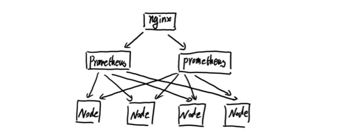
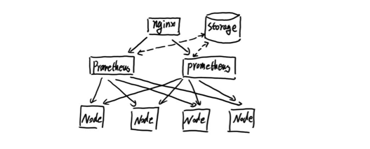
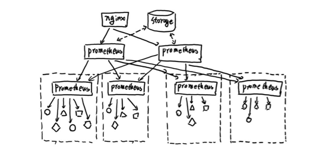

# Prometheus高可用部署

Prometheus的本地存储给Prometheus带来了简单高效的使用体验，可以让Prometheus在单节点的情况下满足大部分用户的监控需求。但是本地存储也同时限制了Prometheus的可扩展性，带来了数据持久化等一系列的问题。通过Prometheus的Remote Storage特性可以解决这一系列问题，包括Prometheus的动态扩展，以及历史数据的存储。

而除了数据持久化问题以外，影响Prometheus性能表现的另外一个重要因素就是数据采集任务量，以及单台Prometheus能够处理的时间序列数。因此当监控规模大到Prometheus单台无法有效处理的情况下，可以选择利用Prometheus的联邦集群的特性，将Prometheus的监控任务划分到不同的实例当中。

这一部分将重点讨论Prometheus的高可用架构，并且根据不同的使用场景介绍了一种常见的高可用方案。

## 基本HA：服务可用性

由于Prometheus的Pull机制的设计，为了确保Prometheus服务的可用性，用户只需要部署多套Prometheus Server实例，并且采集相同的Exporter目标即可。



基本的HA模式只能确保Prometheus服务的可用性问题，但是不解决Prometheus Server之间的数据一致性问题以及持久化问题(数据丢失后无法恢复)，也无法进行动态的扩展。因此这种部署方式适合监控规模不大，Prometheus Server也不会频繁发生迁移的情况，并且只需要保存短周期监控数据的场景。

## 基本HA + 远程存储

在基本HA模式的基础上通过添加Remote Storage存储支持，将监控数据保存在第三方存储服务上。



在解决了Prometheus服务可用性的基础上，同时确保了数据的持久化，当Prometheus Server发生宕机或者数据丢失的情况下，可以快速的恢复。 同时Prometheus Server可能很好的进行迁移。因此，该方案适用于用户监控规模不大，但是希望能够将监控数据持久化，同时能够确保Prometheus Server的可迁移性的场景。

## 基本HA + 远程存储 + 联邦集群

当单台Prometheus Server无法处理大量的采集任务时，用户可以考虑基于Prometheus联邦集群的方式将监控采集任务划分到不同的Prometheus实例当中即在任务级别功能分区。



这种部署方式一般适用于两种场景：

场景一：单数据中心 + 大量的采集任务

这种场景下Prometheus的性能瓶颈主要在于大量的采集任务，因此用户需要利用Prometheus联邦集群的特性，将不同类型的采集任务划分到不同的Prometheus子服务中，从而实现功能分区。例如一个Prometheus Server负责采集基础设施相关的监控指标，另外一个Prometheus Server负责采集应用监控指标。再有上层Prometheus Server实现对数据的汇聚。

场景二：多数据中心

这种模式也适合与多数据中心的情况，当Prometheus Server无法直接与数据中心中的Exporter进行通讯时，在每一个数据中部署一个单独的Prometheus Server负责当前数据中心的采集任务是一个不错的方式。这样可以避免用户进行大量的网络配置，只需要确保主Prometheus Server实例能够与当前数据中心的Prometheus Server通讯即可。 中心Prometheus Server负责实现对多数据中心数据的聚合。

## 按照实例进行功能分区

这时在考虑另外一种极端情况，即单个采集任务的Target数也变得非常巨大。这时简单通过联邦集群进行功能分区，Prometheus Server也无法有效处理时。这种情况只能考虑继续在实例级别进行功能划分。


如上图所示，将统一任务的不同实例的监控数据采集任务划分到不同的Prometheus实例。通过relabel设置，我们可以确保当前Prometheus Server只收集当前采集任务的一部分实例的监控指标。

```
global:
  external_labels:
    slave: 1  # This is the 2nd slave. This prevents clashes between slaves.
scrape_configs:
  - job_name: some_job
    relabel_configs:
    - source_labels: [__address__]
      modulus:       4
      target_label:  __tmp_hash
      action:        hashmod
    - source_labels: [__tmp_hash]
      regex:         ^1$
      action:        keep
```

并且通过当前数据中心的一个中心Prometheus Server将监控数据进行聚合到任务级别。

```
- scrape_config:
  - job_name: slaves
    honor_labels: true
    metrics_path: /federate
    params:
      match[]:
        - '{__name__=~"^slave:.*"}'   # Request all slave-level time series
    static_configs:
      - targets:
        - slave0:9090
        - slave1:9090
        - slave3:9090
        - slave4:9090
```

## 高可用方案选择

上面的部分，根据不同的场景演示了3种不同的高可用部署方案。当然对于Prometheus部署方案需要用户根据监控规模以及自身的需求进行动态调整，下表展示了Prometheus和高可用有关3个选项各自解决的问题，用户可以根据自己的需求灵活选择。

| 选项\需求 | 服务可用性 | 数据持久化 | 水平扩展|
|--------- |----------|----------|--------|
|  主备HA   |   v      |     x    |    x   |
|  远程存储  |   x      |     v    |    x   |
|  联邦集群  |   x      |     x    |    v   |
