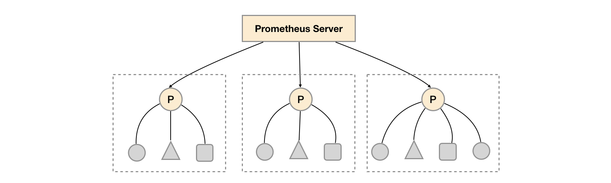
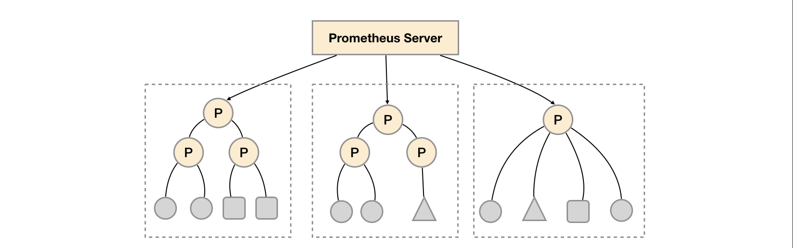

# 联邦集群

通过Remote Storage可以分离监控样本采集和数据存储，解决Prometheus的持久化问题。这一部分会重点讨论如何利用联邦集群特性对Promthues进行扩展，以适应不同监控规模的变化。

## 使用联邦集群

对于大部分监控规模而言，我们只需要在每一个数据中心(例如：EC2可用区，Kubernetes集群)安装一个Prometheus Server实例，就可以在各个数据中心处理上千规模的集群。同时将Prometheus Server部署到不同的数据中心可以避免网络配置的复杂性。



如上图所示，在每个数据中心部署单独的Prometheus Server，用于采集当前数据中心监控数据。并由一个中心的Prometheus Server负责聚合多个数据中心的监控数据。这一特性在Promthues中称为联邦集群。

联邦集群的核心在于每一个Prometheus Server都包含额一个用于获取当前实例中监控样本的接口/federate。对于中心Prometheus Server而言，无论是从其他的Prometheus实例还是Exporter实例中获取数据实际上并没有任何差异。

```
scrape_configs:
  - job_name: 'federate'
    scrape_interval: 15s
    honor_labels: true
    metrics_path: '/federate'
    params:
      'match[]':
        - '{job="prometheus"}'
        - '{__name__=~"job:.*"}'
        - '{__name__=~"node.*"}'
    static_configs:
      - targets:
        - '192.168.77.11:9090'
        - '192.168.77.12:9090'
```

为了有效的减少不必要的时间序列，通过params参数可以用于指定只获取某些时间序列的样本数据，例如

```
"http://192.168.77.11:9090/federate?match[]={job%3D"prometheus"}&match[]={__name__%3D~"job%3A.*"}&match[]={__name__%3D~"node.*"}"
```

通过URL中的match[]参数指定我们可以指定需要获取的时间序列。match[]参数必须是一个瞬时向量选择器，例如up或者{job="api-server"}。配置多个match[]参数，用于获取多组时间序列的监控数据。

**horbor_labels**配置true可以确保当采集到的监控指标冲突时，能够自动忽略冲突的监控数据。如果为false时，prometheus会自动将冲突的标签替换为”exported_<original-label>“的形式。

## 功能分区

联邦集群的特性可以帮助用户根据不同的监控规模对Promthues部署架构进行调整。例如如下所示，可以在各个数据中心中部署多个Prometheus Server实例。每一个Prometheus Server实例只负责采集当前数据中心中的一部分任务(Job)，例如可以将不同的监控任务分离到不同的Prometheus实例当中，再有中心Prometheus实例进行聚合。



功能分区，即通过联邦集群的特性在任务级别对Prometheus采集任务进行划分，以支持规模的扩展。
