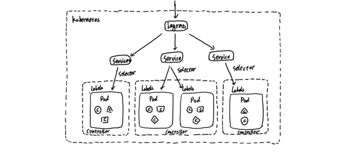
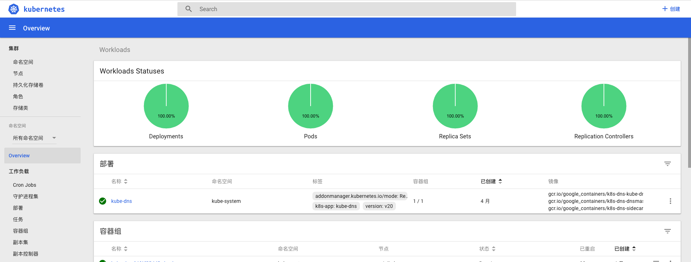
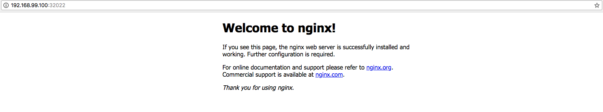

# 初识Kubernetes

Kubenetes是一款由Google开发的开源的容器编排工具（[GitHub源码](https://github.com/kubernetes/kubernetes)），在Google已经使用超过15年（Kubernetest前身是Google的内部工具Borg）。Kubernetes将一系列的主机看做是一个受管理的海量资源，这些海量资源组成了一个能够方便进行扩展的操作系统。而在Kubernetes中运行着的容器则可以视为是这个操作系统中运行的“进程”，通过Kubernetes这一中央协调器，解决了基于容器应用程序的调度、伸缩、访问负载均衡以及整个系统的管理和监控的问题。

## Kubernetes应用管理模型

下图展示了Kubernetes的应用管理模型：



Pod是Kubernetes中的最小调度资源。Pod中会包含一组容器，它们一起工作，并且对外提供一个（或者一组）功能。对于这组容器而言它们共享相同的网络和存储资源，因此它们之间可以直接通过本地网络（127.0.0.1）进行访问。当Pod被创建时，调度器（kube-schedule）会从集群中找到满足条件的节点运行它。

如果部署应用程序时，需要启动多个实例（副本），则需要使用到控制器（Controller）。用户可以在Controller定义Pod的调度规则、运行的副本数量以及升级策略等等信息，当某些Pod发生故障之后，Controller会尝试自动修复，直到Pod的运行状态满足Controller中定义的预期状态为止。Kubernetes中提供了多种Controller的实现，包括：Deployment（无状态应用）、StatefulSet（有状态应用）、Daemonset（守护模式）等，以支持不同类型应用的部署和调度模式。

通过Controller和Pod我们定义了应用程序是如何运行的，接下来需要解决如何使用这些部署在Kubernetes集群中的应用。Kubernetes将这一问题划分为两个问题域，第一，集群内的应用如何通信。第二，外部的用户如何访问部署在集群内的应用？

对于第一个问题，在Kubernetes中通过定义Service（服务）来解决。Service在Kubernetes集群内扮演了服务发现和负载均衡的作用。在Kubernetes下部署的Pod实例都会包含一组描述自身信息的Lable，而创建Service，可以声明一个Selector（标签选择器）。Service通过Selector，找到匹配标签规则的Pod实例，并将对Service的请求转发到代理的Pod中。Service创建完成后，集群内的应用就可以通过使用Service的名称作为DNS域名进行相互访问。

而对于第二个问题，Kubernetes中定义了单独的资源Ingress（入口）。Ingress是一个工作在7层的负载均衡器，其负责代理外部进入集群内的请求，并将流量转发到对应的服务中。

最后，对于同一个Kubernetes集群其可能被多个组织使用，为了隔离这些不同组织创建的应用程序，Kubernetes定义了Namespace（命名空间）对资源进行隔离。

## Kubernetes架构模型

为了能够更好的理解Kubernetes下的监控体系，我们需要了解Kubernetes的基本架构，如下所示，是Kubernetes的架构示意图：


Kubernetes的核心组件主要由两部分组成：Master组件和Node组件，其中Matser组件提供了集群层面的管理功能，它们负责响应用户请求并且对集群资源进行统一的调度和管理。Node组件会运行在集群的所有节点上，它们负责管理和维护节点中运行的Pod，为Kubernetes集群提供运行时环境。

Master组件主要包括：

* kube-apiserver：负责对外暴露Kubernetes API；
* etcd：用于存储Kubernetes集群的所有数据；
* kube-scheduler: 负责为新创建的Pod选择可供其运行的节点；
* kube-controller-manager： 包含Node Controller，Deployment Controller，Endpoint Controller等等，通过与apiserver交互使相应的资源达到预期状态。

Node组件主要包括：

* kubelet：负责维护和管理节点上Pod的运行状态；
* kube-proxy：负责维护主机上的网络规则以及转发。
* Container Runtime：如Docker,rkt,runc等提供容器运行时环境。

## Kubernetes监控策略

Kubernetes作为开源的容器编排工具，为用户提供了一个可以统一调度，统一管理的云操作系统。其解决如用户应用程序如何运行的问题。而一旦在生产环境中大量基于Kubernetes部署和管理应用程序后，作为系统管理员，还需要充分了解应用程序以及Kubernetes集群服务运行质量如何，通过对应用以及集群运行状态数据的收集和分析，持续优化和改进，从而提供一个安全可靠的生产运行环境。 这一小节中我们将讨论当使用Kubernetes时的监控策略该如何设计。

从物理结构上讲Kubernetes主要用于整合和管理底层的基础设施资源，对外提供应用容器的自动化部署和管理能力，这些基础设施可能是物理机、虚拟机、云主机等等。因此，基础资源的使用直接影响当前集群的容量和应用的状态。在这部分，我们需要关注集群中各个节点的主机负载，CPU使用率、内存使用率、存储空间以及网络吞吐等监控指标。

从自身架构上讲，kube-apiserver是Kubernetes提供所有服务的入口，无论是外部的客户端还是集群内部的组件都直接与kube-apiserver进行通讯。因此，kube-apiserver的并发和吞吐量直接决定了集群性能的好坏。其次，对于外部用户而言，Kubernetes是否能够快速的完成pod的调度以及启动，是影响其使用体验的关键因素。而这个过程主要由kube-scheduler负责完成调度工作，而kubelet完成pod的创建和启动工作。因此在Kubernetes集群本身我们需要评价其自身的服务质量，主要关注在Kubernetes的API响应时间，以及Pod的启动时间等指标上。

Kubernetes的最终目标还是需要为业务服务，因此我们还需要能够监控应用容器的资源使用情况。对于内置了对Prometheus支持的应用程序，也要支持从这些应用程序中采集内部的监控指标。最后，结合黑盒监控模式，对集群中部署的服务进行探测，从而当应用发生故障后，能够快速处理和恢复。

综上所述，我们需要综合使用白盒监控和黑盒监控模式，建立从基础设施，Kubernetes核心组件，应用容器等全面的监控体系。

在白盒监控层面我们需要关注：

* 基础设施层（Node）：为整个集群和应用提供运行时资源，需要通过各节点的kubelet获取节点的基本状态，同时通过在节点上部署Node Exporter获取节点的资源使用情况；
* 容器基础设施（Container）：为应用提供运行时环境，Kubelet内置了对cAdvisor的支持，用户可以直接通过Kubelet组件获取给节点上容器相关监控指标；
* 用户应用（Pod）：Pod中会包含一组容器，它们一起工作，并且对外提供一个（或者一组）功能。如果用户部署的应用程序内置了对Prometheus的支持，那么我们还应该采集这些Pod暴露的监控指标；
* Kubernetes组件：获取并监控Kubernetes核心组件的运行状态，确保平台自身的稳定运行。

而在黑盒监控层面，则主要需要关注以下：

* 内部服务负载均衡（Service）：在集群内，通过Service在集群暴露应用功能，集群内应用和应用之间访问时提供内部的负载均衡。通过Balckbox Exporter探测Service的可用性，确保当Service不可用时能够快速得到告警通知；
* 外部访问入口（Ingress）：通过Ingress提供集群外的访问入口，从而可以使外部客户端能够访问到部署在Kubernetes集群内的服务。因此也需要通过Blackbox Exporter对Ingress的可用性进行探测，确保外部用户能够正常访问集群内的功能；

## 搭建本地Kubernetes集群

为了能够更直观的了解和使用Kubernetes，我们将在本地通过工具Minikube([https://github.com/kubernetes/minikube](https://github.com/kubernetes/minikube))搭建一个本地的Kubernetes测试环境。Minikube会在本地通过虚拟机运行一个单节点的Kubernetes集群，可以方便用户或者开发人员在本地进行与Kubernetes相关的开发和测试工作。

安装MiniKube的方式很简单，对于Mac用户可以直接使用Brew进行安装:

```shell
brew cask install minikube
```

其它操作系统用户，可以查看Minikube项目的官方说明文档进行安装即可。安装完成后，在本机通过命令行启动Kubernetes集群:

```shell
$ minikube start
Starting local Kubernetes v1.7.5 cluster...
Starting VM...
SSH-ing files into VM...
Setting up certs...
Starting cluster components...
Connecting to cluster...
Setting up kubeconfig...
Kubectl is now configured to use the cluster.
```

MiniKube会自动配置本机的kubelet命令行工具，用于与对集群资源进行管理。同时Kubernetes也提供了一个Dashboard管理界面，在MiniKube下可以通过以下命令打开：

```shell
$ minikube dashboard
Opening kubernetes dashboard in default browser...
```

Kubernetes中的Dashboard本身也是通过Deployment进行部署的，因此可以通过MiniKube找到当前集群虚拟机的IP地址：

```shell
$ minikube ip
192.168.99.100
```

通过kubectl命令行工具，找到Dashboard对应的Service对外暴露的端口，如下所示，kubernetes-dashboard是一个NodePort类型的Service，并对外暴露了30000端口：

```shell
$ kubectl get service --namespace=kube-system
NAME                   TYPE        CLUSTER-IP       EXTERNAL-IP   PORT(S)         AGE
kube-dns               ClusterIP   10.96.0.10       <none>        53/UDP,53/TCP   131d
kubernetes-dashboard   NodePort    10.105.168.160   <none>        80:30000/TCP    131d
```

在Dashbord中，用户可以可视化的管理当前集群中运行的所有资源，以及监视其资源运行状态。



Kubernetes环境准备完成后，就可以开始尝试在Kubernetes下尝试部署一个应用程序。Kubernetes中管理的所有资源都可以通过YAML文件进行描述。如下所示，创建了一个名为nginx-deploymeht.yml文件：

```yaml
apiVersion: extensions/v1beta1
kind: Deployment
metadata:
  name: nginx-deployment
  labels:
    app: nginx
spec:
  replicas: 3
  selector:
    matchLabels:
      app: nginx
  template:
    metadata:
      labels:
        app: nginx
    spec:
      containers:
      - name: nginx
        image: nginx:1.7.9
        ports:
        - containerPort: 80
```

在该YAML文件中，我们定义了需要创建的资源类型为Deployment，在metadata中声明了该Deployment的名称以及标签。spec中则定义了该Deployment的具体设置，通过replicas定义了该Deployment创建后将会自动创建3个Pod实例。运行的Pod以及进行则通过template进行定义。

在命令行中使用，如下命令：

```shell
$ kubectl create -f nginx-deploymeht.yml
deployment "nginx-deployment" created
```

在未指定命名空间的情况下，kubectl默认关联default命名空间。由于这里没有指定Namespace，该Deployment将会在默认的命令空间default中创建。 通过kubectl get命令查看当前Deployment的部署进度：

```shell
# 查看Deployment的运行状态
$ kubectl get deployments
NAME               DESIRED   CURRENT   UP-TO-DATE   AVAILABLE   AGE
nginx-deployment   3         3         3            3           1m

# 查看运行的Pod实例
$ kubectl get pods
NAME                                READY     STATUS    RESTARTS   AGE
nginx-deployment-6d8f46cfb7-5f9qm   1/1       Running   0          1m
nginx-deployment-6d8f46cfb7-9ppb8   1/1       Running   0          1m
nginx-deployment-6d8f46cfb7-nfmsw   1/1       Running   0          1m
```

为了能够让用户或者其它服务能够访问到Nginx实例，这里通过一个名为nginx-service.yml的文件定义Service资源：

```yaml
kind: Service
apiVersion: v1
metadata:
  name: nginx-service
spec:
  selector:
    app: nginx
  ports:
  - protocol: TCP
    port: 80
    targetPort: 80
  type: NodePort
```

默认情况下，Service资源只能通过集群网络进行访问(type=ClusterIP)。这里为了能够直接访问该Service，需要将容器端口映射到主机上，因此定义该Service类型为NodePort。

创建并查看Service资源：

```shell
$ kubectl create -f nginx-service.yml
service "nginx-service" created

$ kubectl get svc
NAME            TYPE        CLUSTER-IP       EXTERNAL-IP   PORT(S)        AGE
kubernetes      ClusterIP   10.96.0.1        <none>        443/TCP        131d
nginx-service   NodePort    10.104.103.112   <none>        80:32022/TCP   10s
```

通过nginx-server映射到虚拟机的32022端口，就可以直接访问到Nginx实例的80端口：



部署完成后，如果需要对Nginx实例进行扩展，可以使用：

```shell
$ kubectl scale deployments/nginx-deployment --replicas=4
deployment "nginx-deployment" scaled
```

通过kubectl命令还可以对镜像进行滚动升级：

```shell
$ kubectl set image deployment/nginx-deployment nginx=nginx:1.9.1
deployment "nginx-deployment" image updated

$ kubectl get pods
NAME                                READY     STATUS              RESTARTS   AGE
nginx-deployment-58b94fcb9-8fjm6    0/1       ContainerCreating   0          52s
nginx-deployment-58b94fcb9-qzlwx    0/1       ContainerCreating   0          51s
nginx-deployment-6d8f46cfb7-5f9qm   1/1       Running             0          45m
nginx-deployment-6d8f46cfb7-7xs6z   0/1       Terminating         0          2m
nginx-deployment-6d8f46cfb7-9ppb8   1/1       Running             0          45m
nginx-deployment-6d8f46cfb7-nfmsw   1/1       Running             0          45m
```

如果升级后服务出现异常，那么可以通过以下命令对应用进行回滚：

```shell
$ kubectl rollout undo deployment/nginx-deployment
deployment "nginx-deployment"
```

Kubernetes依托于Google丰富的大规模应用管理经验。通过将集群环境抽象为一个统一调度和管理的云"操作系统，视容器为这个操作中独自运行的“进程”，进程间的隔离通过命名空间（Namespace）完成，实现了对应用生命周期管理从自动化到自主化的跨越。
