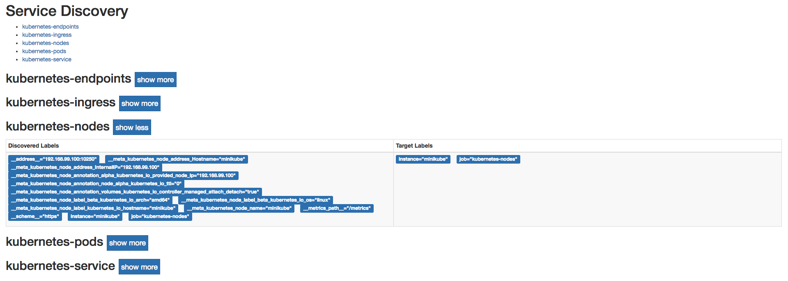
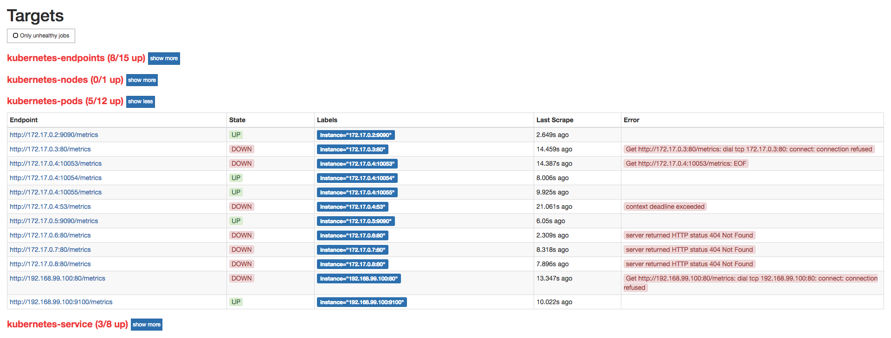

# Kubernetes下的服务发现

目前为止，我们已经能够在Kubernetes下部署一个简单的Prometheus实例，不过当前来说它并不能发挥其监控系统的作用，除了Prometheus，暂时没有任何的监控采集目标。在第7章中，我们介绍了Prometheus的服务发现能力，它能够与通过与“中间代理人“的交互，从而动态的获取需要监控的目标实例。而在Kubernetes下Prometheus就是需要与Kubernetes的API进行交互，从而能够动态的发现Kubernetes中部署的所有可监控的目标资源。

## Kubernetes的访问授权

为了能够让Prometheus能够访问收到认证保护的Kubernetes API，我们首先需要做的是，对Prometheus进行访问授权。在Kubernetes中主要使用基于角色的访问控制模型(Role-Based Access Control)，用于管理Kubernetes下资源访问权限。首先我们需要在Kubernetes下定义角色（ClusterRole），并且为该角色赋予相应的访问权限。同时创建Prometheus所使用的账号（ServiceAccount），最后则是将该账号与角色进行绑定（ClusterRoleBinding）。这些所有的操作在Kubernetes同样被视为是一系列的资源，可以通过YAML文件进行描述并创建，这里创建prometheus-rbac-setup.yml文件，并写入以下内容：

```
apiVersion: rbac.authorization.k8s.io/v1beta1
kind: ClusterRole
metadata:
  name: prometheus
rules:
- apiGroups: [""]
  resources:
  - nodes
  - nodes/proxy
  - services
  - endpoints
  - pods
  verbs: ["get", "list", "watch"]
- apiGroups:
  - extensions
  resources:
  - ingresses
  verbs: ["get", "list", "watch"]
- nonResourceURLs: ["/metrics"]
  verbs: ["get"]
---
apiVersion: v1
kind: ServiceAccount
metadata:
  name: prometheus
  namespace: default
---
apiVersion: rbac.authorization.k8s.io/v1beta1
kind: ClusterRoleBinding
metadata:
  name: prometheus
roleRef:
  apiGroup: rbac.authorization.k8s.io
  kind: ClusterRole
  name: prometheus
subjects:
- kind: ServiceAccount
  name: prometheus
  namespace: default
```

其中需要注意的是ClusterRole是全局的，不需要指定命名空间。而ServiceAccount是属于特定命名空间的资源。通过kubectl命令创建RBAC对应的各个资源：

```
$ kubectl create -f prometheus-rbac-setup.yml
clusterrole "prometheus" created
serviceaccount "prometheus" created
clusterrolebinding "prometheus" created
```

在完成角色权限以及用户的绑定之后，就可以指定Prometheus使用特定的ServiceAccount创建Pod实例。修改prometheus-deployment.yml文件，并添加serviceAccountName和serviceAccount定义：

```
spec:
  replicas: 1
  template:
    metadata:
      labels:
        app: prometheus
    spec:
      serviceAccountName: prometheus
      serviceAccount: prometheus
```

通过kubectl apply对Deployment进行变更升级：

```
$ kubectl apply -f prometheus-deployment.yml
service "prometheus" configured
deployment "prometheus" configured

$ kubectl get pods
NAME                               READY     STATUS        RESTARTS   AGE
prometheus-55f655696d-wjqcl        0/1       Terminating   0          38m
prometheus-69f9ddb588-czn2c        1/1       Running       0          6s
```

指定ServiceAccount创建的Pod实例中，会自动将用于访问Kubernetes API的CA证书以及当前账户对应的访问令牌文件挂载到Pod实例的/var/run/secrets/kubernetes.io/serviceaccount/目录下，可以通过以下命令进行查看：

```
kubectl exec -it prometheus-69f9ddb588-czn2c ls /var/run/secrets/kubernetes.io/serviceaccount/
ca.crt     namespace  token
```

## 服务发现

在Kubernetes下，Promethues通过与Kubernetes API集成目前主要支持5种服务发现模式，分别是：Node、Service、Pod、Endpoints、Ingress。

通过kubectl命令行，可以方便的获取到当前集群中的所有节点信息：

```
$ kubectl get nodes -o wide
NAME       STATUS    ROLES     AGE       VERSION   EXTERNAL-IP   OS-IMAGE            KERNEL-VERSION   CONTAINER-RUNTIME
minikube   Ready     <none>    164d      v1.8.0    <none>        Buildroot 2017.02   4.9.13           docker://Unknown
```

为了能够让Prometheus能够获取到当前集群中所有节点的信息，在Prometheus的配置文件中，我们添加如下Job配置：

```
- job_name: 'kubernetes-nodes'
  tls_config:
    ca_file: /var/run/secrets/kubernetes.io/serviceaccount/ca.crt
  bearer_token_file: /var/run/secrets/kubernetes.io/serviceaccount/token
  kubernetes_sd_configs:
  - role: node
```

通过指定kubernetes_sd_config的模式为node，Prometheus会自动从Kubernetes中发现到所有的node节点并作为当前Job监控的Target实例。如下所示，这里需要指定用于访问Kubernetes API的ca以及token文件路径。

对于Ingress，Service，Endpoints, Pod的使用方式也是类似的，下面给出了一个完整Prometheus配置的示例：

```
apiVersion: v1
data:
  prometheus.yml: |-
    global:
      scrape_interval:     15s 
      evaluation_interval: 15s
    scrape_configs:

    - job_name: 'kubernetes-nodes'
      tls_config:
        ca_file: /var/run/secrets/kubernetes.io/serviceaccount/ca.crt
      bearer_token_file: /var/run/secrets/kubernetes.io/serviceaccount/token
      kubernetes_sd_configs:
      - role: node

    - job_name: 'kubernetes-service'
      tls_config:
        ca_file: /var/run/secrets/kubernetes.io/serviceaccount/ca.crt
      bearer_token_file: /var/run/secrets/kubernetes.io/serviceaccount/token
      kubernetes_sd_configs:
      - role: service
   
    - job_name: 'kubernetes-endpoints'
      tls_config:
        ca_file: /var/run/secrets/kubernetes.io/serviceaccount/ca.crt
      bearer_token_file: /var/run/secrets/kubernetes.io/serviceaccount/token
      kubernetes_sd_configs:
      - role: endpoints

    - job_name: 'kubernetes-ingress'
      tls_config:
        ca_file: /var/run/secrets/kubernetes.io/serviceaccount/ca.crt
      bearer_token_file: /var/run/secrets/kubernetes.io/serviceaccount/token
      kubernetes_sd_configs:
      - role: ingress
 
    - job_name: 'kubernetes-pods'
      tls_config:
        ca_file: /var/run/secrets/kubernetes.io/serviceaccount/ca.crt
      bearer_token_file: /var/run/secrets/kubernetes.io/serviceaccount/token
      kubernetes_sd_configs:
      - role: pod

kind: ConfigMap
metadata:
  name: prometheus-config
```

更新Prometheus配置文件，并重建Prometheus实例：

```
$ kubectl apply -f prometheus-config.yml
configmap "prometheus-config" configured

$ kubectl get pods
prometheus-69f9ddb588-rbrs2        1/1       Running   0          4m

$ kubectl delete pods prometheus-69f9ddb588-rbrs2
pod "prometheus-69f9ddb588-rbrs2" deleted

$ kubectl get pods
prometheus-69f9ddb588-rbrs2        0/1       Terminating   0          4m
prometheus-69f9ddb588-wtlsn        1/1       Running       0          14s
```

Prometheus使用新的配置文件重建之后，打开Prometheus UI，通过Service Discovery页面可以查看到当前Prometheus通过Kubernetes发现的所有资源对象了：



同时Prometheus会自动将该资源的所有信息，并通过标签的形式体现在Target对象上。如下所示，是Prometheus获取到的Node节点的标签信息：

```
__address__="192.168.99.100:10250"
__meta_kubernetes_node_address_Hostname="minikube"
__meta_kubernetes_node_address_InternalIP="192.168.99.100"
__meta_kubernetes_node_annotation_alpha_kubernetes_io_provided_node_ip="192.168.99.100"
__meta_kubernetes_node_annotation_node_alpha_kubernetes_io_ttl="0"
__meta_kubernetes_node_annotation_volumes_kubernetes_io_controller_managed_attach_detach="true"
__meta_kubernetes_node_label_beta_kubernetes_io_arch="amd64"
__meta_kubernetes_node_label_beta_kubernetes_io_os="linux"
__meta_kubernetes_node_label_kubernetes_io_hostname="minikube"
__meta_kubernetes_node_name="minikube"
__metrics_path__="/metrics"
__scheme__="https"
instance="minikube"
job="kubernetes-nodes"
```

目前为止，我们已经能够通过Prometheus自动发现Kubernetes集群中的各类资源以及其基本信息。不过，如果现在查看Prometheus的Target状态页面，结果可能会让人不太满意：



虽然Prometheus能够自动发现所有的资源对象，并且将其作为Target对象进行数据采集。 但并不是所有的资源对象都是支持Promethues的，并且不同类型资源对象的采集方式可能是不同的。因此，在实际的操作中，我们需要有明确的监控目标，并且针对不同类型的监控目标设置不同的数据采集方式。

接下来，我们将利用Prometheus的服务发现能力，实现对Kubernetes集群的全面监控。
