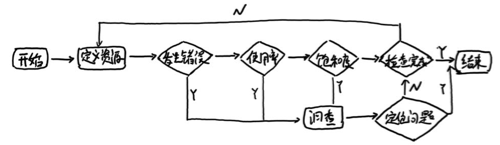

# 最佳实践：4个黄金指标和USE方法

前面部分介绍了Prometheus的数据存储模型以及4种指标类型，同时Prometheus提供的强大的PromQL可以实现对数据的个性化处理。Promthues基于指标提供了一个通用的监控解决方案。这里先思考一个基本的问题，在实现监控时，我们到底应该监控哪些对象以及哪些指标？

## 监控所有

在之前**Prometheus简介**部分介绍监控的基本目标，首先是及时发现问题，其次是要能够快速对问题进行定位。对于传统监控解决方案而言，用户看到的依然是一个黑盒，用户无法真正了解系统的真正的运行状态。因此Prometheus鼓励用户监控所有的东西。下面列举一些常用的监控维度。

|   级别               | 监控什么                                              |    Exporter                     | 
|--------             |---------                                             |                       ----------|
|   网络               | 网络协议：http、dns、tcp、icmp；网络硬件：路由器，交换机等  | BlackBox Exporter;SNMP Exporter |
|   主机               | 资源用量                                              |     node exporter               |
|   容器               | 资源用量                                              |     cAdvisor                    |
|   应用(包括Library)   |  延迟，错误，QPS，内部状态等                             |     代码中集成Prmometheus Client  |
|   中间件状态          |  资源用量，以及服务状态                                 |     代码中集成Prmometheus Client  |
|   编排工具           |  集群资源用量，调度等                                    |     Kubernetes Components       |

## 监控模式

除了上述介绍的不同监控级别以外。实际上根据不同的系统类型和目标，这里还有一些通用的套路和模式可以使用。

## 4个黄金指标

Four Golden Signals是Google针对大量分布式监控的经验总结，4个黄金指标可以在服务级别帮助衡量终端用户体验、服务中断、业务影响等层面的问题。主要关注与以下四种类型的指标：延迟，通讯量，错误以及饱和度：

* 延迟：服务请求所需时间。

记录用户所有请求所需的时间，重点是要区分成功请求的延迟时间和失败请求的延迟时间。 例如在数据库或者其他关键祸端服务异常触发HTTP 500的情况下，用户也可能会很快得到请求失败的响应内容，如果不加区分计算这些请求的延迟，可能导致计算结果与实际结果产生巨大的差异。除此以外，在微服务中通常提倡“快速失败”，开发人员需要特别注意这些延迟较大的错误，因为这些缓慢的错误会明显影响系统的性能，因此追踪这些错误的延迟也是非常重要的。

* 通讯量：监控当前系统的流量，用于衡量服务的容量需求。

流量对于不同类型的系统而言可能代表不同的含义。例如，在HTTP REST API中, 流量通常是每秒HTTP请求数；

* 错误：监控当前系统所有发生的错误请求，衡量当前系统错误发生的速率。

对于失败而言有些是显式的(比如, HTTP 500错误)，而有些是隐式(比如，HTTP响应200，但实际业务流程依然是失败的)。

对于一些显式的错误如HTTP 500可以通过在负载均衡器(如Nginx)上进行捕获，而对于一些系统内部的异常，则可能需要直接从服务中添加钩子统计并进行获取。

* 饱和度：衡量当前服务的饱和度。

主要强调最能影响服务状态的受限制的资源。 例如，如果系统主要受内存影响，那就主要关注系统的内存状态，如果系统主要受限与磁盘I/O，那就主要观测磁盘I/O的状态。因为通常情况下，当这些资源达到饱和后，服务的性能会明显下降。同时还可以利用饱和度对系统做出预测，比如，“磁盘是否可能在4个小时候就满了”。

## RED方法

RED方法是Weave Cloud在基于Google的“4个黄金指标”的原则下结合Prometheus以及Kubernetes容器实践，细化和总结的方法论，特别适合于云原生应用以及微服务架构应用的监控和度量。主要关注以下三种关键指标：

* (请求)速率：服务每秒接收的请求数。
* (请求)错误：每秒失败的请求数。
* (请求)耗时：每个请求的耗时。

在“4大黄金信号”的原则下，RED方法可以有效的帮助用户衡量云原生以及微服务应用下的用户体验问题。

## USE方法

USE方法全称"Utilization Saturation and Errors Method"，主要用于分析系统性能问题，可以指导用户快速识别资源瓶颈以及错误的方法。正如USE方法的名字所表示的含义，USE方法主要关注与资源的：使用率(Utilization)、饱和度(Saturation)以及错误(Errors)。

* 使用率：关注系统资源的使用情况。 这里的资源主要包括但不限于：CPU，内存，网络，磁盘等等。100%的使用率通常是系统性能瓶颈的标志。
* 饱和度：例如CPU的平均运行排队长度，这里主要是针对资源的饱和度(注意，不同于4大黄金信号)。任何资源在某种程度上的饱和都可能导致系统性能的下降。
* 错误：错误计数。例如：“网卡在数据包传输过程中检测到的以太网网络冲突了14次”。

通过对资源以上指标持续观察，通过以下流程可以知道用户识别资源瓶颈：

