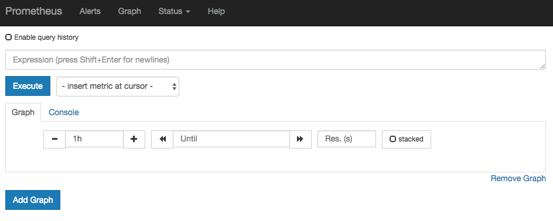
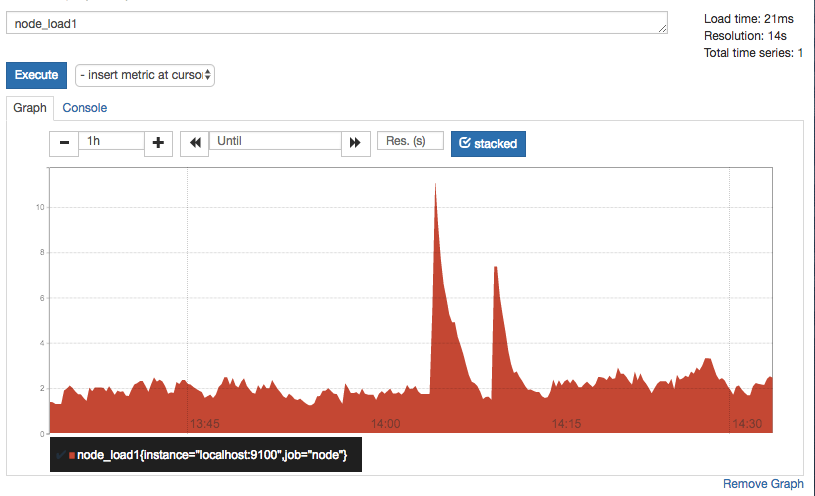
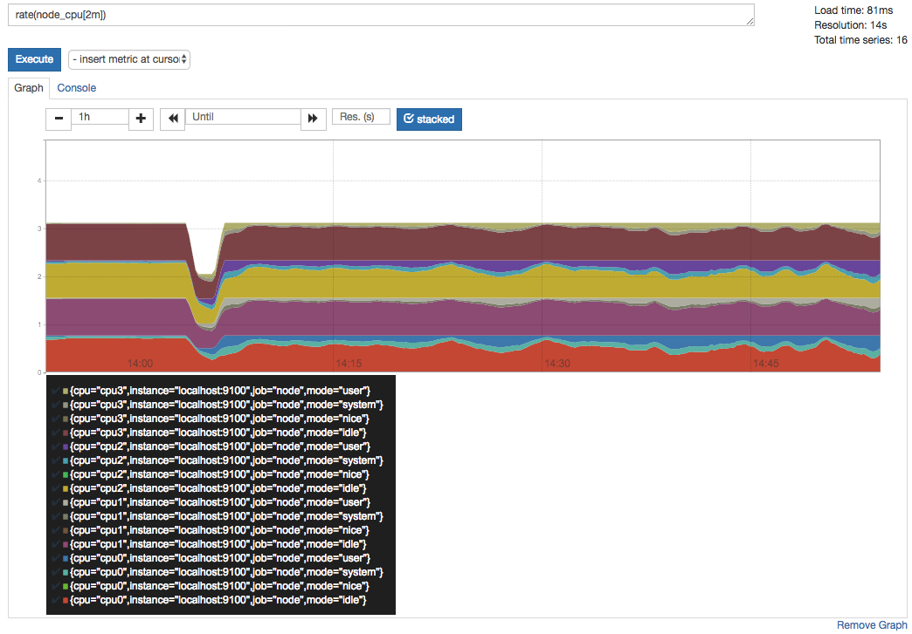
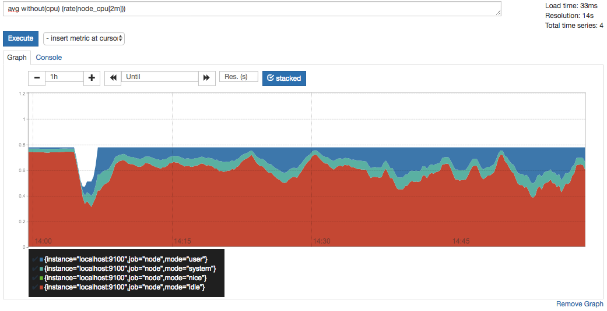
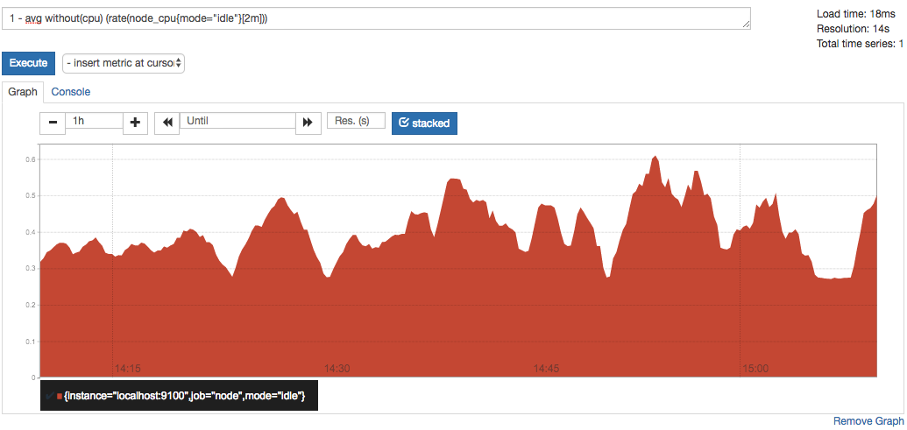
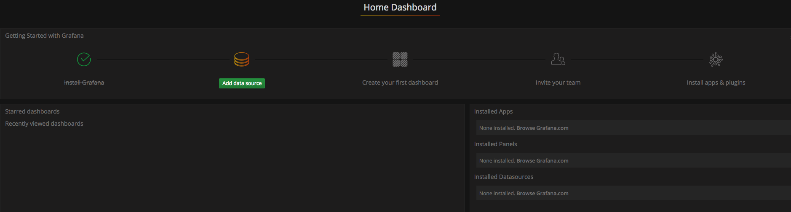
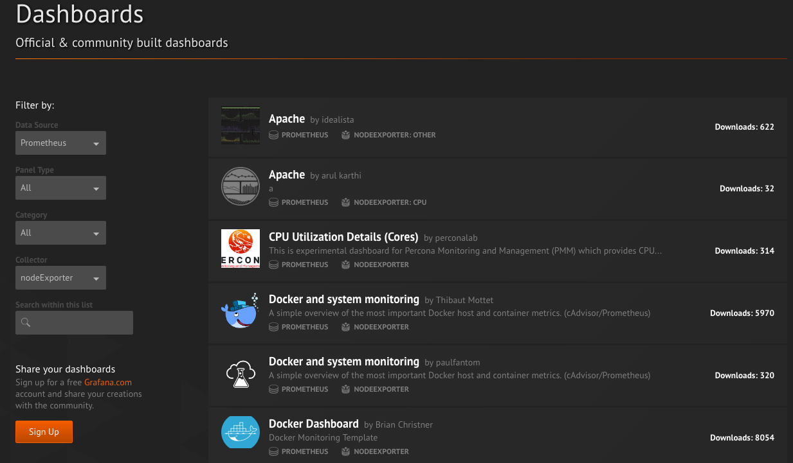
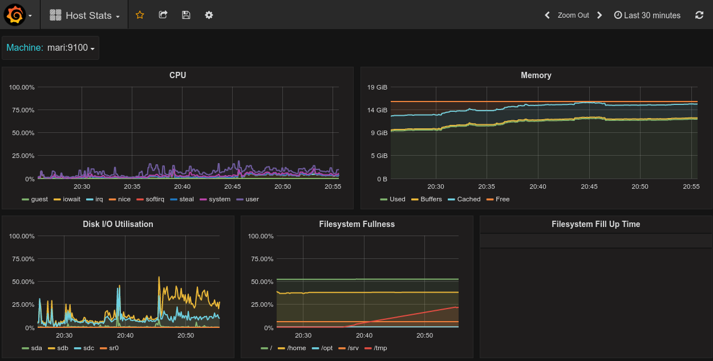

# 初识Prometheus

为了能够更加直观的了解Prometheus Server，接下来我们将在本地部署一个Prometheus Server实例，并且配合Node Exporter程序实现对本地主机指标的监控。

#### 安装Prometheus Server

Prometheus基于Golang编写，编译后的软件包，不依赖于任何的第三方依赖。用户只需要下载对应平台的二进制包，解压并且添加基本的配置即可正常启动Prometheus Server。

对于非Docker用户，可以从[https://prometheus.io/download/](https://prometheus.io/download/)找到最新版本的Prometheus Sevrer软件包：

```
export VERSION=2.4.3
curl -LO  https://github.com/prometheus/prometheus/releases/download/$VERSION/prometheus-$VERSION.darwin-amd64.tar.gz
```

解压，并将Prometheus相关的命令，添加到系统环境变量路径即可：

```
tar -xzf prometheus-${VERSION}.darwin-amd64.tar.gz
cp prometheus-${VERSION}.darwin-amd64/prometheus /usr/local/bin/
cp prometheus-${VERSION}.darwin-amd64/promtool /usr/local/bin/

sudo mkdir -p /data/prometheus
```

解压后当前目录会包含默认的Prometheus配置文件promethes.yml，拷贝配置文件到/etc/prometheus/prometheus.yml:

```
global:
  scrape_interval:     15s # Set the scrape interval to every 15 seconds. Default is every 1 minute.
  evaluation_interval: 15s # Evaluate rules every 15 seconds. The default is every 1 minute.
  # scrape_timeout is set to the global default (10s).

# Alertmanager configuration
alerting:
  alertmanagers:
  - static_configs:
    - targets:
      # - alertmanager:9093

# Load rules once and periodically evaluate them according to the global 'evaluation_interval'.
rule_files:
  # - "first_rules.yml"
  # - "second_rules.yml"

# A scrape configuration containing exactly one endpoint to scrape:
# Here it's Prometheus itself.
scrape_configs:
  # The job name is added as a label `job=<job_name>` to any timeseries scraped from this config.
  - job_name: 'prometheus'

    # metrics_path defaults to '/metrics'
    # scheme defaults to 'http'.

    static_configs:
      - targets: ['localhost:9090']
```

启动prometheus服务：

```
prometheus --config.file=/etc/prometheus/prometheus.yml --storage.tsdb.path=/data/prometheus
```

正常的情况下，你可以看到以下输出内容：

```
msg="Loading configuration file" filename=/etc/prometheus/prometheus.yml
level=info ts=2018-03-11T13:38:06.317645234Z caller=main.go:486 msg="Server is ready to receive web requests."
level=info ts=2018-03-11T13:38:06.317679086Z caller=manager.go:59 component="scrape manager" msg="Starting scrape manager..."
```

对于Docker用户，直接使用Prometheus的镜像即可启动Prometheus Server：

```
docker run -p 9090:9090 -v /etc/prometheus/prometheus.yml:/etc/prometheus/prometheus.yml prom/prometheus
```

启动完成后，可以通过[http://localhost:9090](http://localhost:9090)访问Prometheus的UI界面：


#### 使用Node Exporter采集主机运行数据

在Prometheus的架构设计中，Prometheus Server并不直接服务监控特定的目标，其主要任务负责数据的收集，存储并且对外提供数据查询支持。因此为了能够能够监控到某些东西，如主机的CPU使用率，我们需要使用到Exporter。Prometheus周期性的从Exporter暴露的HTTP服务地址（通常是/metrics）拉取监控样本数据。

从上面的描述中可以看出Exporter可以是一个相对开放的概念，其可以是一个独立运行的程序独立于监控目标以外，也可以是直接内置在监控目标中。只要能够向Prometheus提供标准格式的监控样本数据即可。

这里为了能够采集到主机的运行指标如CPU, 内存，磁盘等信息。我们可以使用[Node Exporter](https://github.com/prometheus/node_exporter)。

Node Exporter同样采用Golang编写，并且不存在任何的第三方依赖，只需要下载，解压即可运行。可以从[https://prometheus.io/download/](https://prometheus.io/download/)获取最新的node exporter版本的二进制包。

```
curl -OL https://github.com/prometheus/node_exporter/releases/download/v0.15.2/node_exporter-0.15.2.darwin-amd64.tar.gz
tar -xzf node_exporter-0.15.2.darwin-amd64.tar.gz
```

运行node exporter:

```
cd node_exporter-0.15.2.darwin-amd64
cp node_exporter-0.15.2.darwin-amd64/node_exporter /usr/local/bin/
node_exporter
```

启动成功后，可以看到以下输出：

```
INFO[0000] Listening on :9100                            source="node_exporter.go:76"
```

访问[http://localhost:9100/](http://localhost:9100/)可以看到以下页面：


## Node Exporter监控指标

访问[http://localhost:9100/metrics](http://localhost:9100/metrics)，可以看到当前node exporter获取到的当前主机的所有监控数据，如下所示：


每一个监控指标之前都会有一段类似于如下形式的信息：

```
# HELP node_cpu Seconds the cpus spent in each mode.
# TYPE node_cpu counter
node_cpu{cpu="cpu0",mode="idle"} 362812.7890625
# HELP node_load1 1m load average.
# TYPE node_load1 gauge
node_load1 3.0703125
```

其中HELP用于解释当前指标的含义，TYPE则说明当前指标的数据类型。在上面的例子中node_cpu的注释表明当前指标是cpu0上idle进程占用CPU的总时间，CPU占用时间是一个只增不减的度量指标，从类型中也可以看出node_cpu的数据类型是计数器(counter)，与该指标的实际含义一致。又例如node_load1该指标反映了当前主机在最近一分钟以内的负载情况，系统的负载情况会随系统资源的使用而变化，因此node_load1反映的是当前状态，数据可能增加也可能减少，从注释中可以看出当前指标类型为仪表盘(gauge)，与指标反映的实际含义一致。

除了这些以外，在当前页面中根据物理主机系统的不同，你还可能看到如下监控指标：

* node_boot_time：系统启动时间
* node_cpu：系统CPU使用量
* node_disk_*：磁盘IO
* node_filesystem_*：文件系统用量
* node_load1：系统负载
* node_memeory_*：内存使用量
* node_network_*：网络带宽
* node_time：当前系统时间
* go_*：node exporter中go相关指标
* process_*：node exporter自身进程相关运行指标

为了能够让Prometheus Server能够从当前node exporter获取到监控数据，这里需要修改Prometheus配置文件。编辑prometheus.yml并在scrape_configs节点下添加以下内容:

```
scrape_configs:
  - job_name: 'prometheus'
    static_configs:
      - targets: ['localhost:9090']
  # 采集node exporter监控数据
  - job_name: 'node'
    static_configs:
      - targets: ['localhost:9100']
```

重新启动Prometheus Server

访问[http://localhost:9090](http://localhost:9090)，进入到Prometheus Server。如果输入“up”并且点击执行按钮以后，可以看到如下结果：


如果Prometheus能够正常从node exporter获取数据，则会看到以下结果：

```
up{instance="localhost:9090",job="prometheus"}	1
up{instance="localhost:9100",job="node"}	1
```

其中“1”表示正常，反之“0”则为异常。

## 数据与可视化

### 使用Prometheus UI

通过Prometheus UI用户可以利用PromQL实时查询监控数据，并且支持一些基本的数据可视化能力。进入到Prometheus UI,切换到Graph标签



通过PromQL则可以直接以可视化的形式显示查询到的数据。例如，查询主机负载变化情况，可以使用：

```
node_load1
```



查询主机CPU的使用率，由于node_cpu的数据类型是Counter，计算使用率需要使用rate()函数：

```
rate(node_cpu[2m])
```



这时如果要忽略是哪一个CPU的，只需要使用without表达式，将标签CPU去除后聚合数据即可：

```
avg without(cpu) (rate(node_cpu[2m]))
```



那如果需要计算系统CPU的总体使用率，通过排除系统闲置的CPU使用率即可获得:

```
1 - avg without(cpu) (rate(node_cpu{mode="idle"}[2m]))
```



从上面这些例子中可以看出，根据样本中的标签可以很方便地对数据进行查询，过滤以及聚合等操作。同时PromQL中还提供了大量的诸如rate()这样的函数可以实现对数据的更多个性化的处理。

## 使用Grafana创建可视化Dashboard

Prometheus UI提供了快速验证PromQL以及临时可视化支持的能力，而在大多数场景下引入监控系统通常还需要构建可以长期使用的监控数据可视化面板（Dashboard）。这时用户可以考虑使用第三方的可视化工具如Grafana，Grafana是一个开源的可视化平台，并且提供了对Prometheus的完整支持。

```
docker run -d -p 3000:3000 grafana/grafana
```

访问[http://localhost:3000](http://localhost:3000)就可以进入到Grafana的界面中，默认情况下使用账户admin/admin进行登录。在Grafana首页中显示默认的使用向导，包括：安装、添加数据源、创建Dashboard、邀请成员、以及安装应用和插件等主要流程:



这里将添加Prometheus作为默认的数据源，如下图所示，指定数据源类型为Prometheus并且设置Prometheus的访问地址即可，在配置正确的情况下点击“Add”按钮，会提示连接成功的信息：


在完成数据源的添加之后就可以在Grafana中创建我们可视化Dashboard了。Grafana提供了对PromQL的完整支持，如下所示，通过Grafana添加Dashboard并且为该Dashboard添加一个类型为“Graph”的面板。 并在该面板的“Metrics”选项下通过PromQL查询需要可视化的数据：


点击界面中的保存选项，就创建了我们的第一个可视化Dashboard了。 当然作为开源软件，Grafana社区鼓励用户分享Dashboard通过[https://grafana.com/dashboards](https://grafana.com/dashboards)网站，可以找到大量可直接使用的Dashboard：



Grafana中所有的Dashboard通过JSON进行共享，下载并且导入这些JSON文件，就可以直接使用这些已经定义好的Dashboard：

