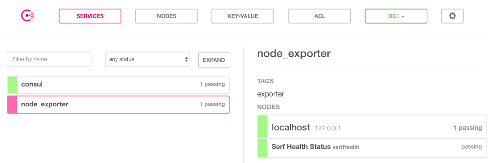

# 基于Consul的服务发现

Consul是由HashiCorp开发的一个支持多数据中心的分布式服务发现和键值对存储服务的开源软件，被大量应用于基于微服务的软件架构当中。

## Consul初体验

用户可以通过Consul官网[https://www.consul.io/downloads.html](https://www.consul.io/downloads.html)下载对应操作系统版本的软件包。Consul与Prometheus同样使用Go语言进行开发，因此安装和部署的方式也极为简单，解压并将命令行工具放到系统PATH路径下即可。

在本地可以使用开发者模式在本地快速启动一个单节点的Consul环境：

```
$ consul agent -dev
==> Starting Consul agent...
==> Consul agent running!
           Version: 'v1.0.7'
           Node ID: 'd7b590ba-e2f8-3a82-e8a8-2a911bdf67d5'
         Node name: 'localhost'
        Datacenter: 'dc1' (Segment: '<all>')
            Server: true (Bootstrap: false)
       Client Addr: [127.0.0.1] (HTTP: 8500, HTTPS: -1, DNS: 8600)
      Cluster Addr: 127.0.0.1 (LAN: 8301, WAN: 8302)
           Encrypt: Gossip: false, TLS-Outgoing: false, TLS-Incoming: false
```

在启动成功后，在一个新的terminal窗口中运行consul members可以查看当前集群中的所有节点：

```
$ consul members
Node       Address         Status  Type    Build  Protocol  DC   Segment
localhost  127.0.0.1:8301  alive   server  1.0.7  2         dc1  <all>
```

用户还可以通过HTTP API的方式查看当前集群中的节点信息：

```
$ curl localhost:8500/v1/catalog/nodes
[
    {
        "ID": "d7b590ba-e2f8-3a82-e8a8-2a911bdf67d5",
        "Node": "localhost",
        "Address": "127.0.0.1",
        "Datacenter": "dc1",
        "TaggedAddresses": {
            "lan": "127.0.0.1",
            "wan": "127.0.0.1"
        },
        "Meta": {
            "consul-network-segment": ""
        },
        "CreateIndex": 5,
        "ModifyIndex": 6
    }
]
```

Consul还提供了内置的DNS服务，可以通过Consul的DNS服务的方式访问其中的节点：

```
$ dig @127.0.0.1 -p 8600 localhost.node.consul

; <<>> DiG 9.9.7-P3 <<>> @127.0.0.1 -p 8600 localhost.node.consul
; (1 server found)
;; global options: +cmd
;; Got answer:
;; ->>HEADER<<- opcode: QUERY, status: NOERROR, id: 50684
;; flags: qr aa rd; QUERY: 1, ANSWER: 1, AUTHORITY: 0, ADDITIONAL: 1
;; WARNING: recursion requested but not available

;; OPT PSEUDOSECTION:
; EDNS: version: 0, flags:; udp: 4096
;; QUESTION SECTION:
;localhost.node.consul.		IN	A

;; ANSWER SECTION:
localhost.node.consul.	0	IN	A	127.0.0.1

;; Query time: 5 msec
;; SERVER: 127.0.0.1#8600(127.0.0.1)
;; WHEN: Sun Apr 15 22:10:56 CST 2018
;; MSG SIZE  rcvd: 66
```

在Consul当中服务可以通过服务定义文件或者是HTTP API的方式进行注册。这里使用服务定义文件的方式将本地运行的node_exporter通过服务的方式注册到Consul当中。

创建配置目录：

```
sudo mkdir /etc/consul.d
```

```
echo '{"service": {"name": "node_exporter", "tags": ["exporter"], "port": 9100}}' \
    | sudo tee /etc/consul.d/node_exporter.json
```

重新启动Consul服务，并且声明服务定义文件所在目录：

```
$ consul agent -dev -config-dir=/etc/consul.d
==> Starting Consul agent...
    2018/04/15 22:23:47 [DEBUG] agent: Service "node_exporter" in sync
```

一旦服务注册成功之后，用户就可以通过DNS或HTTP API的方式查询服务信息。默认情况下，所有的服务都可以使用NAME.service.consul域名的方式进行访问。

例如，可以使用node_exporter.service.consul域名查询node_exporter服务的信息：

```
$ dig @127.0.0.1 -p 8600 node_exporter.service.consul

;; QUESTION SECTION:
;node_exporter.service.consul.	IN	A

;; ANSWER SECTION:
node_exporter.service.consul. 0	IN	A	127.0.0.1
```

如上所示DNS记录会返回当前可用的node_exporter服务实例的IP地址信息。

除了使用DNS的方式以外，Consul还支持用户使用HTTP API的形式获取服务列表：

```
$ curl http://localhost:8500/v1/catalog/service/node_exporter
[
    {
        "ID": "e561b376-2c1b-653d-61a0-1d844bce06a7",
        "Node": "localhost",
        "Address": "127.0.0.1",
        "Datacenter": "dc1",
        "TaggedAddresses": {
            "lan": "127.0.0.1",
            "wan": "127.0.0.1"
        },
        "NodeMeta": {
            "consul-network-segment": ""
        },
        "ServiceID": "node_exporter",
        "ServiceName": "node_exporter",
        "ServiceTags": [
            "exporter"
        ],
        "ServiceAddress": "",
        "ServiceMeta": {},
        "ServicePort": 9100,
        "ServiceEnableTagOverride": false,
        "CreateIndex": 6,
        "ModifyIndex": 6
    }
]
```

Consul也提供了一个Web UI可以查看Consul中所有服务以及节点的状态：



当然Consul还提供了更多的API用于支持对服务的生命周期管理（添加、删除、修改等）这里就不做过多的介绍，感兴趣的同学可以通过Consul官方文档了解更多的详细信息。

## 与Prometheus集成

Consul作为一个通用的服务发现和注册中心，记录并且管理了环境中所有服务的信息。Prometheus通过与Consul的交互可以获取到相应Exporter实例的访问信息。在Prometheus的配置文件当可以通过以下方式与Consul进行集成：

```
- job_name: node_exporter
    metrics_path: /metrics
    scheme: http
    consul_sd_configs:
      - server: localhost:8500
        services:
          - node_exporter
```

在consul_sd_configs定义当中通过server定义了Consul服务的访问地址，services则定义了当前需要发现哪些类型服务实例的信息，这里限定了只获取node_exporter的服务实例信息。