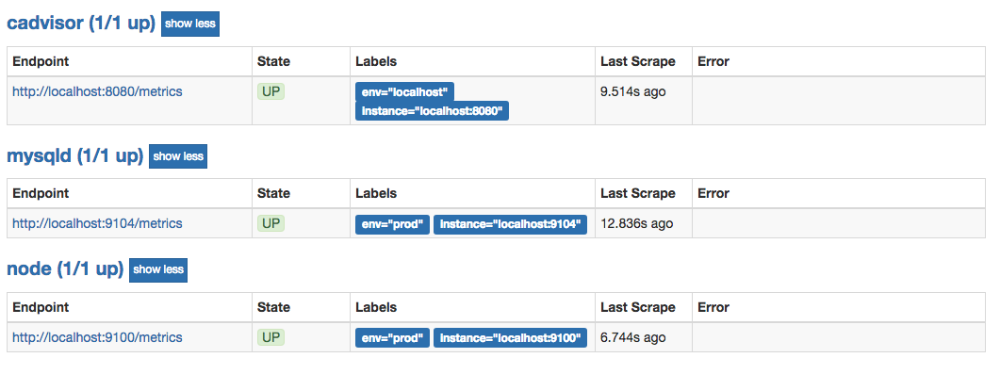

# 基于文件的服务发现

在Prometheus支持的众多服务发现的实现方式中，基于文件的服务发现是最通用的方式。这种方式不需要依赖于任何的平台或者第三方服务。对于Prometheus而言也不可能支持所有的平台或者环境。通过基于文件的服务发现方式下，Prometheus会定时从文件中读取最新的Target信息，因此，你可以通过任意的方式将监控Target的信息写入即可。

用户可以通过JSON或者YAML格式的文件，定义所有的监控目标。例如，在下面的JSON文件中分别定义了3个采集任务，以及每个任务对应的Target列表：

```
[
  {
    "targets": [ "localhost:8080"],
    "labels": {
      "env": "localhost",
      "job": "cadvisor"
    }
  },
  {
    "targets": [ "localhost:9104" ],
    "labels": {
      "env": "prod",
      "job": "mysqld"
    }
  },
  {
    "targets": [ "localhost:9100"],
    "labels": {
      "env": "prod",
      "job": "node"
    }
  }
]
```

同时还可以通过为这些实例添加一些额外的标签信息，例如使用env标签标示当前节点所在的环境，这样从这些实例中采集到的样本信息将包含这些标签信息，从而可以通过该标签按照环境对数据进行统计。

创建Prometheus配置文件/etc/prometheus/prometheus-file-sd.yml，并添加以下内容：

```
global:
  scrape_interval: 15s
  scrape_timeout: 10s
  evaluation_interval: 15s
scrape_configs:
- job_name: 'file_ds'
  file_sd_configs:
  - files:
    - targets.json
```

这里定义了一个基于file_sd_configs的监控采集任务，其中模式的任务名称为file_ds。在JSON文件中可以使用job标签覆盖默认的job名称，此时启动Prometheus服务：

```
prometheus --config.file=/etc/prometheus/prometheus-file-sd.yml --storage.tsdb.path=/data/prometheus
```

在Prometheus UI的Targets下就可以看到当前从targets.json文件中动态获取到的Target实例信息以及监控任务的采集状态，同时在Labels列下会包含用户添加的自定义标签:



Prometheus默认每5m重新读取一次文件内容，当需要修改时，可以通过refresh_interval进行设置，例如：

```
- job_name: 'file_ds'
  file_sd_configs:
  - refresh_interval: 1m
    files:
    - targets.json
```

通过这种方式，Prometheus会自动的周期性读取文件中的内容。当文件中定义的内容发生变化时，不需要对Prometheus进行任何的重启操作。

这种通用的方式可以衍生了很多不同的玩法，比如与自动化配置管理工具(Ansible)结合、与Cron Job结合等等。 对于一些Prometheus还不支持的云环境，比如国内的阿里云、腾讯云等也可以使用这种方式通过一些自定义程序与平台进行交互自动生成监控Target文件，从而实现对这些云环境中基础设施的自动化监控支持。