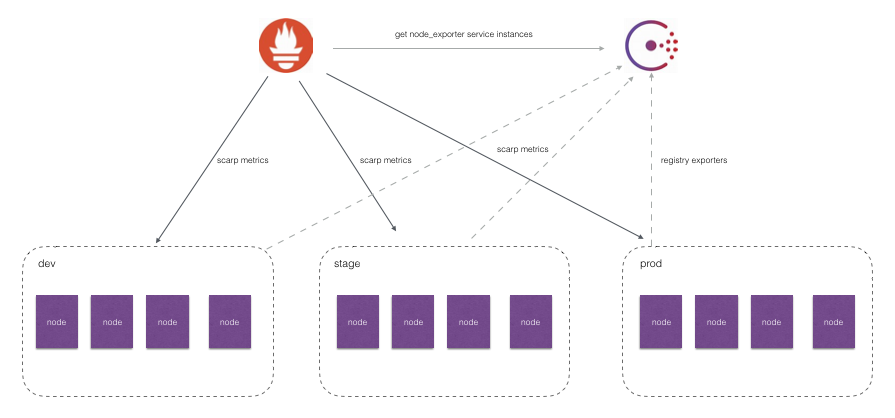
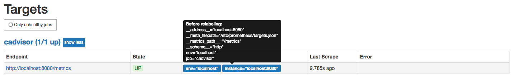
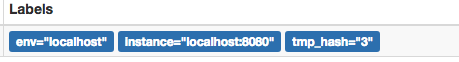

# 服务发现与Relabeling

在本章的前几个小节中笔者已经分别介绍了Prometheus的几种服务发现机制。通过服务发现的方式，管理员可以在不重启Prometheus服务的情况下动态的发现需要监控的Target实例信息。



如上图所示，对于线上环境我们可能会划分为:dev, stage, prod不同的集群。每一个集群运行多个主机节点，每个服务器节点上运行一个Node Exporter实例。Node Exporter实例会自动注册到Consul中，而Prometheus则根据Consul返回的Node Exporter实例信息动态的维护Target列表，从而向这些Target轮询监控数据。

然而，如果我们可能还需要：

* 按照不同的环境dev, stage, prod聚合监控数据？
* 对于研发团队而言，我可能只关心dev环境的监控数据，如何处理？
* 如果为每一个团队单独搭建一个Prometheus Server。那么如何让不同团队的Prometheus Server采集不同的环境监控数据？

面对以上这些场景下的需求时，我们实际上是希望Prometheus Server能够按照某些规则（比如标签）从服务发现注册中心返回的Target实例中有选择性的采集某些Exporter实例的监控数据。

接下来，我们将学习如何通过Prometheus强大的Relabel机制来实现以上这些具体的目标。

## Prometheus的Relabeling机制

在Prometheus所有的Target实例中，都包含一些默认的Metadata标签信息。可以通过Prometheus UI的Targets页面中查看这些实例的Metadata标签的内容：



默认情况下，当Prometheus加载Target实例完成后，这些Target时候都会包含一些默认的标签：

* ```__address__```：当前Target实例的访问地址```<host>:<port>```
* ```__scheme__```：采集目标服务访问地址的HTTP Scheme，HTTP或者HTTPS
* ```__metrics_path__```：采集目标服务访问地址的访问路径
* ```__param_<name>```：采集任务目标服务的中包含的请求参数

上面这些标签将会告诉Prometheus如何从该Target实例中获取监控数据。除了这些默认的标签以外，我们还可以为Target添加自定义的标签，例如，在“基于文件的服务发现”小节中的示例中，我们通过JSON配置文件，为Target实例添加了自定义标签env，如下所示该标签最终也会保存到从该实例采集的样本数据中：

```
node_cpu{cpu="cpu0",env="prod",instance="localhost:9100",job="node",mode="idle"}
```

一般来说，Target以```__```作为前置的标签是在系统内部使用的，因此这些标签不会被写入到样本数据中。不过这里有一些例外，例如，我们会发现所有通过Prometheus采集的样本数据中都会包含一个名为instance的标签，该标签的内容对应到Target实例的```__address__```。 这里实际上是发生了一次标签的重写处理。

这种发生在采集样本数据之前，对Target实例的标签进行重写的机制在Prometheus被称为Relabeling。


Prometheus允许用户在采集任务设置中通过relabel_configs来添加自定义的Relabeling过程。

## 使用replace/labelmap重写标签

Relabeling最基本的应用场景就是基于Target实例中包含的metadata标签，动态的添加或者覆盖标签。例如，通过Consul动态发现的服务实例还会包含以下Metadata标签信息：

* __meta_consul_address：consul地址
* __meta_consul_dc：consul中服务所在的数据中心
* __meta_consulmetadata：服务的metadata
* __meta_consul_node：服务所在consul节点的信息
* __meta_consul_service_address：服务访问地址
* __meta_consul_service_id：服务ID
* __meta_consul_service_port：服务端口
* __meta_consul_service：服务名称
* __meta_consul_tags：服务包含的标签信息

在默认情况下，从Node Exporter实例采集上来的样本数据如下所示：

```
node_cpu{cpu="cpu0",instance="localhost:9100",job="node",mode="idle"} 93970.8203125
```

我们希望能有一个额外的标签dc可以表示该样本所属的数据中心：

```
node_cpu{cpu="cpu0",instance="localhost:9100",job="node",mode="idle", dc="dc1"} 93970.8203125
```

在每一个采集任务的配置中可以添加多个relabel_config配置，一个最简单的relabel配置如下：

```
scrape_configs:
  - job_name: node_exporter
    consul_sd_configs:
      - server: localhost:8500
        services:
          - node_exporter
    relabel_configs:
    - source_labels:  ["__meta_consul_dc"]
      target_label: "dc"
```

该采集任务通过Consul动态发现Node Exporter实例信息作为监控采集目标。在上一小节中，我们知道通过Consul动态发现的监控Target都会包含一些额外的Metadata标签，比如标签__meta_consul_dc表明了当前实例所在的Consul数据中心，因此我们希望从这些实例中采集到的监控样本中也可以包含这样一个标签，例如：

```
node_cpu{cpu="cpu0",dc="dc1",instance="172.21.0.6:9100",job="consul_sd",mode="guest"}
```

这样可以方便的根据dc标签的值，根据不同的数据中心聚合分析各自的数据。

在这个例子中，通过从Target实例中获取__meta_consul_dc的值，并且重写所有从该实例获取的样本中。

完整的relabel_config配置如下所示：

```
# The source labels select values from existing labels. Their content is concatenated
# using the configured separator and matched against the configured regular expression
# for the replace, keep, and drop actions.
[ source_labels: '[' <labelname> [, ...] ']' ]

# Separator placed between concatenated source label values.
[ separator: <string> | default = ; ]

# Label to which the resulting value is written in a replace action.
# It is mandatory for replace actions. Regex capture groups are available.
[ target_label: <labelname> ]

# Regular expression against which the extracted value is matched.
[ regex: <regex> | default = (.*) ]

# Modulus to take of the hash of the source label values.
[ modulus: <uint64> ]

# Replacement value against which a regex replace is performed if the
# regular expression matches. Regex capture groups are available.
[ replacement: <string> | default = $1 ]

# Action to perform based on regex matching.
[ action: <relabel_action> | default = replace ]
```

其中action定义了当前relabel_config对Metadata标签的处理方式，默认的action行为为replace。 replace行为会根据regex的配置匹配source_labels标签的值（多个source_label的值会按照separator进行拼接），并且将匹配到的值写入到target_label当中，如果有多个匹配组，则可以使用${1}, ${2}确定写入的内容。如果没匹配到任何内容则不对target_label进行重新。

repalce操作允许用户根据Target的Metadata标签重写或者写入新的标签键值对，在多环境的场景下，可以帮助用户添加与环境相关的特征维度，从而可以更好的对数据进行聚合。

除了使用replace以外，还可以定义action的配置为labelmap。与replace不同的是，labelmap会根据regex的定义去匹配Target实例所有标签的名称，并且以匹配到的内容为新的标签名称，其值作为新标签的值。

例如，在监控Kubernetes下所有的主机节点时，为将这些节点上定义的标签写入到样本中时，可以使用如下relabel_config配置：

```
- job_name: 'kubernetes-nodes'
  kubernetes_sd_configs:
  - role: node
  relabel_configs:
  - action: labelmap
    regex: __meta_kubernetes_node_label_(.+)
```

而使用labelkeep或者labeldrop则可以对Target标签进行过滤，仅保留符合过滤条件的标签，例如：

```
relabel_configs:
  - regex: label_should_drop_(.+)
    action: labeldrop
```

该配置会使用regex匹配当前Target实例的所有标签，并将符合regex规则的标签从Target实例中移除。labelkeep正好相反，会移除那些不匹配regex定义的所有标签。

## 使用keep/drop过滤Target实例

在上一部分中我们介绍了Prometheus的Relabeling机制，并且使用了replace/labelmap/labelkeep/labeldrop对标签进行管理。而本节开头还提到过第二个问题，使用中心化的服务发现注册中心时，所有环境的Exporter实例都会注册到该服务发现注册中心中。而不同职能（开发、测试、运维）的人员可能只关心其中一部分的监控数据，他们可能各自部署的自己的Prometheus Server用于监控自己关心的指标数据，如果让这些Prometheus Server采集所有环境中的所有Exporter数据显然会存在大量的资源浪费。如何让这些不同的Prometheus Server采集各自关心的内容？答案还是Relabeling，relabel_config的action除了默认的replace以外，还支持keep/drop行为。例如，如果我们只希望采集数据中心dc1中的Node Exporter实例的样本数据，那么可以使用如下配置：

```
scrape_configs:
  - job_name: node_exporter
    consul_sd_configs:
      - server: localhost:8500
        services:
          - node_exporter
    relabel_configs:
    - source_labels:  ["__meta_consul_dc"]
      regex: "dc1"
      action: keep
```

当action设置为keep时，Prometheus会丢弃source_labels的值中没有匹配到regex正则表达式内容的Target实例，而当action设置为drop时，则会丢弃那些source_labels的值匹配到regex正则表达式内容的Target实例。可以简单理解为keep用于选择，而drop用于排除。

## 使用hashmod计算source_labels的Hash值

当relabel_config设置为hashmod时，Prometheus会根据modulus的值作为系数，计算source_labels值的hash值。例如：

```
scrape_configs
- job_name: 'file_ds'
  relabel_configs:
    - source_labels: [__address__]
      modulus:       4
      target_label:  tmp_hash
      action:        hashmod
  file_sd_configs:
  - files:
    - targets.json
```

根据当前Target实例```__address__```的值以4作为系数，这样每个Target实例都会包含一个新的标签tmp_hash，并且该值的范围在1~4之间，查看Target实例的标签信息，可以看到如下的结果，每一个Target实例都包含了一个新的tmp_hash值：



在第6章的“Prometheus高可用”小节中，正是利用了Hashmod的能力在Target实例级别实现对采集任务的功能分区的:

```
scrape_configs:
  - job_name: some_job
    relabel_configs:
    - source_labels: [__address__]
      modulus:       4
      target_label:  __tmp_hash
      action:        hashmod
    - source_labels: [__tmp_hash]
      regex:         ^1$
      action:        keep
```

这里需要注意的是，如果relabel的操作只是为了产生一个临时变量，以作为下一个relabel操作的输入，那么我们可以使用```__tmp```作为标签名的前缀，通过该前缀定义的标签就不会写入到Target或者采集到的样本的标签中。
