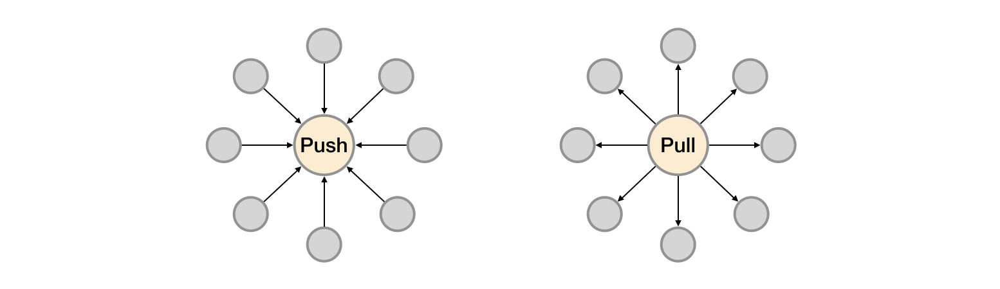

# Prometheus与服务发现

在基于云(IaaS或者CaaS)的基础设施环境中用户可以像使用水、电一样按需使用各种资源（计算、网络、存储）。按需使用就意味着资源的动态性，这些资源可以随着需求规模的变化而变化。例如在AWS中就提供了专门的Auto Scaling服务，可以根据用户定义的规则动态地创建或者销毁EC2实例，从而使用户部署在AWS上的应用可以自动的适应访问规模的变化。

这种按需的资源使用方式对于监控系统而言就意味着没有了一个固定的监控目标，所有的监控对象(基础设施、应用、服务)都在动态的变化。对于Nagios这类基于Push模式传统监控软件就意味着必须在每一个节点上安装相应的Agent程序，并且通过配置指向中心的Nagios服务，受监控的资源与中心监控服务器之间是一个强耦合的关系，要么直接将Agent构建到基础设施镜像当中，要么使用一些自动化配置管理工具(如Ansible、Chef)动态的配置这些节点。当然实际场景下除了基础设施的监控需求以外，我们还需要监控在云上部署的应用，中间件等等各种各样的服务。要搭建起这样一套中心化的监控系统实施成本和难度是显而易见的。

而对于Prometheus这一类基于Pull模式的监控系统，显然也无法继续使用的static_configs的方式静态的定义监控目标。而对于Prometheus而言其解决方案就是引入一个中间的代理人（服务注册中心），这个代理人掌握着当前所有监控目标的访问信息，Prometheus只需要向这个代理人询问有哪些监控目标即可， 这种模式被称为服务发现。

在不同的场景下，会有不同的东西扮演代理人（服务发现与注册中心）这一角色。比如在AWS公有云平台或者OpenStack的私有云平台中，由于这些平台自身掌握着所有资源的信息，此时这些云平台自身就扮演了代理人的角色。Prometheus通过使用平台提供的API就可以找到所有需要监控的云主机。在Kubernetes这类容器管理平台中，Kubernetes掌握并管理着所有的容器以及服务信息，那此时Prometheus只需要与Kubernetes打交道就可以找到所有需要监控的容器以及服务对象。Prometheus还可以直接与一些开源的服务发现工具进行集成，例如在微服务架构的应用程序中，经常会使用到例如Consul这样的服务发现注册软件，Promethues也可以与其集成从而动态的发现需要监控的应用服务实例。除了与这些平台级的公有云、私有云、容器云以及专门的服务发现注册中心集成以外，Prometheus还支持基于DNS以及文件的方式动态发现监控目标，从而大大的减少了在云原生，微服务以及云模式下监控实施难度。

如上所示，展示了Push系统和Pull系统的核心差异。相较于Push模式，Pull模式的优点可以简单总结为以下几点：

* 只要Exporter在运行，你可以在任何地方（比如在本地），搭建你的监控系统；
* 你可以更容易的查看监控目标实例的健康状态，并且可以快速定位故障；
* 更利于构建DevOps文化的团队；
* 松耦合的架构模式更适合于云原生的部署环境。
